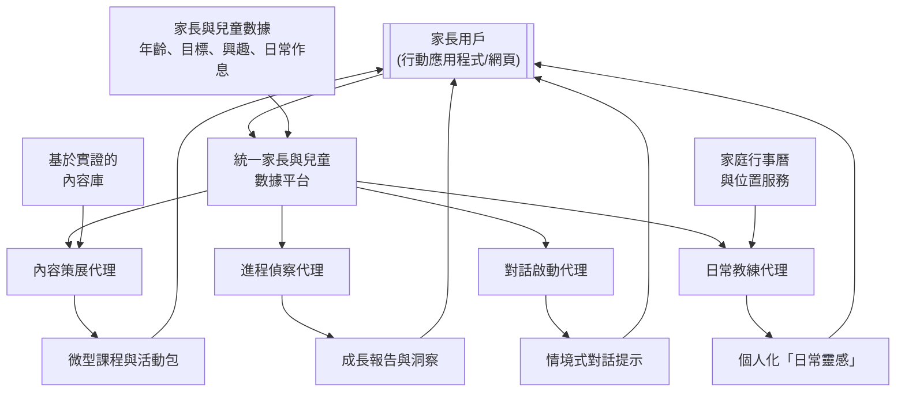
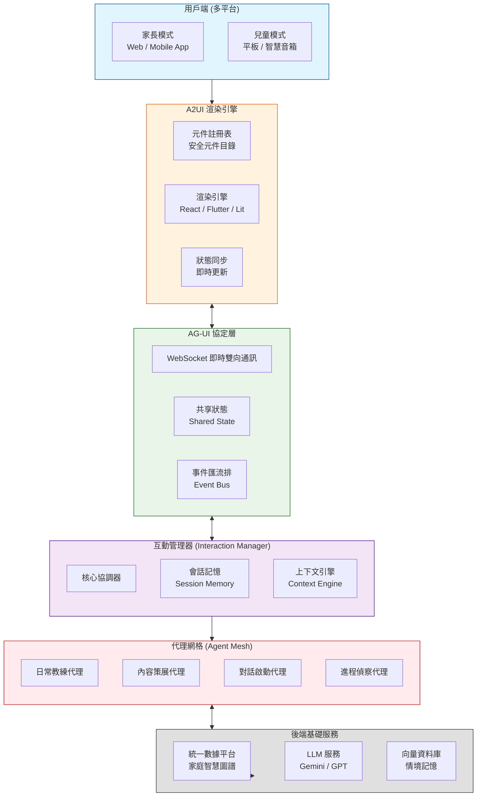
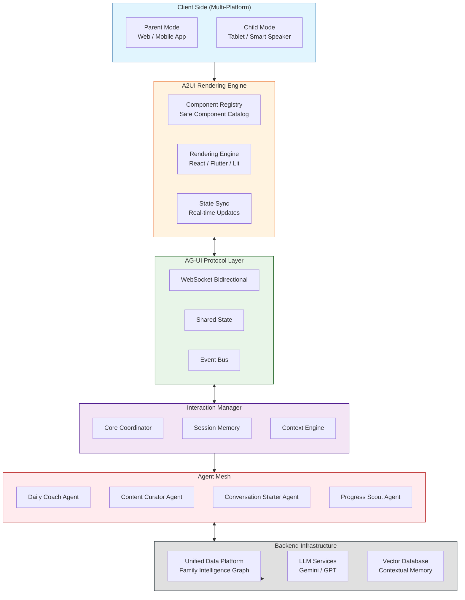

Parents today face the challenge of integrating education into busy daily lives, and agentic AI offers a powerful way to provide personalized, on-demand support. Below is a concept and a technical system design for an online business that educates parents on daily life-oriented learning for their children.

### 🌱 The Concept: "Parent-Led" Daily Education Platform

The core idea is to move beyond scheduled lessons and create a system that helps parents turn everyday moments—like grocery shopping, bedtime, or a walk in the park—into educational opportunities. The platform, which we could call **"EduMoment,"** would act as a personalized AI family coach.

- **Target Audience:** Parents of children aged 2–12.
- **Core Value Proposition:** To empower parents with the right tools, knowledge, and real-time support to confidently cultivate their child's cognitive, social-emotional, and practical life skills through daily interactions.
- **Key Differentiator:** Unlike static parenting blogs or forums, "EduMoment" uses agentic AI to create a **dynamic, responsive, and personalized** learning ecosystem for the *parent*, which then benefits the child. It doesn't just provide information; it actively helps parents apply it in their unique family context.

### 🏗️ Online System Design: The Agentic AI Ecosystem

The technical architecture would be a multi-agent system built on a unified data platform, inspired by the "agentic enterprise" models seen in forward-thinking institutions like DeVry University . Each AI agent has a specific job, working autonomously to support the parent.

Here is a visual overview of how these agents interact within the system:

```mermaid
Here is the detailed implementation architecture for the modern Human-Machine Interface of the "EduMoment" platform, including implementation tools, the application of Agentic AI, the development technology stack, and a system diagram, all presented in English.

---

## Modern Human-Machine Interface Implementation Architecture: Building a Generative UI-Driven Family Conversation Partner

### Core Design Philosophy: Evolving from "Chatbot" to "Interface Generation Engine"

Traditional chat interfaces only present AI responses as text bubbles, which is insufficient for the complexities of parenting and child development scenarios. Our core implementation leverages a **Generative UI** architecture—where AI agents generate not just text, but dynamically create the most suitable interactive interface for the current context.

For example, when a parent asks, "I want to plan a week of focus-building games for my 4-year-old," the system won't just return a text suggestion. It will generate an interactive weekly planner containing **draggable activity cards, timer buttons, and a sticker collection area** for completed tasks.

### High-Level System Architecture Diagram

Below is the overall architecture for the "EduMoment" modern human-machine interface, adopting an **event-driven Interaction Manager pattern** that separates decision logic from interface rendering:

```mermaid
flowchart TB
    subgraph User["Client Side (Multi-Platform)"]
        direction TB
        P[Parent Mode<br/>Web / Mobile App]
        C[Child Mode<br/>Tablet / Smart Speaker]
    end

    subgraph A2UI["A2UI Rendering Engine"]
        direction LR
        CR[Component Registry<br/>Safe Component Catalog]
        RE[Rendering Engine<br/>React / Flutter / Lit]
        SM[State Sync<br/>Real-time Updates]
    end

    subgraph AGUI["AG-UI Protocol Layer"]
        direction LR
        WS[WebSocket Bidirectional]
        SS[Shared State]
        EV[Event Bus]
    end

    subgraph InteractionManager["Interaction Manager"]
        direction TB
        IM[Core Coordinator]
        SM_IM[Session Memory]
        CE[Context Engine]
    end

    subgraph AgentMesh["Agent Mesh"]
        direction TB
        DC[Daily Coach Agent]
        CC[Content Curator Agent]
        CS[Conversation Starter Agent]
        PS[Progress Scout Agent]
    end

    subgraph BackendServices["Backend Infrastructure"]
        direction TB
        UD[Unified Data Platform<br/>Family Intelligence Graph]
        LLM[LLM Services<br/>Gemini / GPT]
        VDB[Vector Database<br/>Contextual Memory]
    end

    %% Connections
    User --> A2UI
    A2UI <--> AGUI
    AGUI <--> InteractionManager
    InteractionManager --> AgentMesh
    AgentMesh <--> BackendServices
    BackendServices -.-> UD
    
    %% Styling
    classDef client fill:#e1f5fe,stroke:#01579b
    classDef a2ui fill:#fff3e0,stroke:#e65100
    classDef protocol fill:#e8f5e8,stroke:#1b5e20
    classDef manager fill:#f3e5f5,stroke:#4a148c
    classDef agents fill:#ffebee,stroke:#b71c1c
    classDef backend fill:#e0e0e0,stroke:#263238
    
    class User client
    class A2UI a2ui
    class AGUI protocol
    class InteractionManager manager
    class AgentMesh agents
    class BackendServices backend
```

### Core Architecture Components Explained

#### 1. Client Side: Dual-Mode Design

- **Parent Mode**: Web / Mobile App, supporting complex dashboards, child progress analysis, and settings management
- **Child Mode**: Tablet / Smart Speaker, focused on large icons and voice interaction, featuring a "Virtual Buddy" character interface

#### 2. A2UI Rendering Engine: Safe and Dynamic Interface Generation

A2UI is an open project initiated by Google specifically addressing the challenges of agent-generated UI. Its core design principles are:

- **Security First**: UI is transmitted as **declarative data formats**, not executable code. The client maintains a "Trusted Component Catalog," and agents can only request components from this catalog (such as Card, Button, Chart), completely preventing UI injection attacks
- **LLM-Friendly**: UI is represented as a flat list of components with ID references, making it easy for LLMs to generate incrementally and achieve progressive rendering
- **Framework Agnostic**: The same A2UI JSON can render across different frameworks like React, Flutter, and SwiftUI

**Implementation Example**: When a child asks "Why is the sky blue?", the agent's response might include:

```json
{
  "components": [
    { "id": "c1", "type": "Card", "props": { "title": "The Magic of Light" } },
    { "id": "c2", "type": "Image", "props": { "url": "scattering_diagram.png" } },
    { "id": "c3", "type": "Button", "props": { "text": "Try an Experiment", "action": "show_experiment" } }
  ]
}
```

#### 3. AG-UI Protocol Layer: The Communication Bridge Between Agents and Frontend

AG-UI is an open protocol designed to standardize direct communication between agents and users, supporting rich UI interactions. Key features:

- **Shared State**: Both frontend and backend agents share an understanding of the application state, enabling agents to react to user actions in the UI and vice versa
- **Human-in-the-Loop**: Users can supervise, approve, or correct agent executions, ensuring safety and control
- **Frontend Tools**: Agents can interact directly with the frontend, such as filling forms, navigating pages, or annotating documents

#### 4. Interaction Manager: Event-Driven Decision Core

Referencing NVIDIA's **Interaction Manager architecture pattern**, we separate decision logic from sensor input and action execution:

- **Event-Driven**: All user actions (voice, clicks, gestures) are converted into events, with the Interaction Manager determining how the system should respond
- **Context-Aware**: Integrates information from the Unified Data Platform to understand the current family context
- **Multi-Agent Coordination**: Coordinates the work of four core agents, reducing the cognitive burden on the user

### Deep Application Strategy for Agentic AI

#### 1. Mixed-Initiative Design Patterns

Based on the HAX framework, we adopt proven mixed-initiative design patterns:

- **Intent Preview**: Allow users to preview and confirm actions before the agent executes them. For example, before sending a daily parenting tip, display: "Tomorrow at 8:00 AM, I'll give you a math game idea for grocery shopping"
- **Iterative Alignment**: Allow users to gradually adjust the agent's behavior. For instance, a parent could say, "This activity is too difficult for my child, make it simpler," and the agent will adjust and regenerate in real-time
- **Trust Repair**: When the agent makes a mistake, provide clear explanations and correction mechanisms

#### 2. Multi-Agent Narrative Consistency

To ensure a consistent experience when family members interact with different agents, we adopt the **Behavioral Proxy** concept to coordinate all agent activities, ensuring:

- **Tone Consistency**: Regardless of which agent responds, maintain the warm, professional "Family Coach" tone
- **Memory Consistency**: When a child asks a question in Children's Mode during the day, the agent can naturally reference it when the parent inquires in the evening

### Detailed Technology Stack Planning

#### Frontend Technology Stack

| Component | Technology Choice | Description |
|-----------|-------------------|-------------|
| **Web Frontend** | Next.js + React + TypeScript | Supports SSR, excellent developer experience |
| **Mobile App** | Flutter | Cross-platform, single codebase for iOS/Android, integrates well with A2UI |
| **Child Mode** | Flutter for Web / Tablet | Focused on large icons, voice interaction |
| **UI Component Library** | CopilotKit React Components | Provides out-of-the-box conversational interfaces, sidebars, etc. |
| **Generative UI** | A2UI + AG-UI Client | Handles dynamic interface rendering |
| **State Management** | Redux Toolkit / Riverpod | Manages local state |
| **Voice Interface** | Web Speech API / Flutter TTS | Voice input and output |

#### Backend Technology Stack

| Component | Technology Choice | Description |
|-----------|-------------------|-------------|
| **API Gateway** | Node.js + Express / FastAPI | Handles request routing |
| **Real-time Communication** | WebSocket + Socket.io | Enables AG-UI real-time bidirectional communication |
| **LLM Services** | Google ADK + Gemini / OpenAI | ADK provides multi-step planning, tool use, state management |
| **Agent Framework** | LangChain / LangGraph | Builds multi-agent collaboration workflows |
| **Vector Database** | Pinecone / Weaviate | Stores contextual memory, past conversations |
| **Unified Data Platform** | PostgreSQL + Neo4j | Relational DB + Graph DB, builds "Family Intelligence Graph" |
| **Data Processing** | Apache Kafka | Handles real-time event streams |

#### DevOps & Infrastructure

| Component | Technology Choice |
|-----------|-------------------|
| **Containerization** | Docker + Kubernetes |
| **CI/CD** | GitHub Actions |
| **Monitoring** | Prometheus + Grafana |
| **Logging** | ELK Stack |

### Detailed Implementation Roadmap

#### Phase 1: MVP (3 Months)
- Establish basic architecture: Next.js frontend + ADK backend
- Implement single agent (Daily Coach) text-based conversational interface
- Integrate CopilotKit React components for rapid conversational UI development
- Basic user authentication and data storage

#### Phase 2: Voice & Generative UI (2 Months)
- Integrate Web Speech API for voice input/output
- Implement A2UI for simple generative cards (e.g., activity suggestion cards)
- Establish unified AI "tone of voice guide"
- Develop parent-facing conversation summary dashboard

#### Phase 3: Child Mode & Multi-Agent (3 Months)
- Develop Flutter-based Child Mode
- Launch "Dino Coach" virtual buddy character
- Implement full collaboration between four core agents
- Introduce MCP Apps standard for richer interactive UI

#### Phase 4: Emotional Intelligence & Personalization (2 Months)
- Integrate sentiment analysis to detect emotional cues in user voice/text
- Implement personalized memory: agents remember children's preferences and interests
- Introduce mixed-initiative design patterns (Intent Preview, Iterative Alignment)
- Full launch

### Security and Privacy Design

- **On-Device Processing First**: Children's voice data processed locally on device, only anonymized analysis results uploaded
- **Component Security Catalog**: A2UI's core security mechanism—client maintains a whitelist of trusted components
- **Data Minimization**: Only collect data necessary for core functionality
- **Transparency Dashboard**: Parents can view data usage at any time and control sharing settings

### Summary

The core advantages of this modern human-machine interface implementation architecture are:

1.  **Generative UI**: The interface is no longer static but dynamically generated based on conversational context
2.  **Standardized Protocols**: Adopts open standards like A2UI and AG-UI, avoiding vendor lock-in
3.  **Event-Driven Architecture**: Follows NVIDIA's Interaction Manager pattern for flexible multi-agent collaboration
4.  **Security First**: Component security catalog ensures dynamically generated interfaces don't introduce security risks

This architecture enables the "EduMoment" platform to truly realize the vision of being a **"warm family conversation partner"**—where technology recedes into the background and interaction returns to its most natural state.
```

The following sections break down the core components of this design.

#### 1. The Central Nervous System: A Unified Data Platform
All agentic AI systems require a single source of truth to be effective . This platform would store and connect all family data securely:
- **Child Profiles:** Age, developmental stage, known interests (e.g., dinosaurs, space), learning goals (e.g., improve emotional regulation, learn counting), and any areas of challenge.
- **Parent Preferences:** Parenting style, available time, personal goals for their child.
- **Family Context:** Daily routines, upcoming events (e.g., a doctor's visit, a family trip), and even location data (with permission) to understand if the family is at home, the grocery store, or a park.

#### 2. The Core AI Agents
With a unified data profile, several specialized agents can work in concert:

- **The Daily Coach Agent:** This is the primary interface for the parent. It proactively suggests "Moment Ideas." For example, if the family calendar shows a grocery trip and the child's profile indicates a goal to learn basic math, the agent might suggest: **"At the store today, have your child help weigh apples and estimate the total cost. Here's a simple way to explain it."** This turns a chore into a learning moment .

- **The Content Curator Agent:** This agent works in the background, using Retrieval-Augmented Generation (RAG) to sift through a vast library of evidence-based articles, videos, and expert advice . Instead of overwhelming parents with a search engine, the agent curates a 3-minute "micro-lesson" for the parent on a topic they've shown interest in, like "handling tantrums" or "fostering curiosity" .

- **The Conversation Starter Agent:** Based on research showing the power of guided conversation , this agent generates prompts tailored to the child's day. It might ask: **"Your child's class is studying plants this week. On the way home, ask them: 'If you were a plant, what would you need to grow big and strong?'"** This goes beyond simple questions to foster deeper, creative thinking .

- **The Progress Scout Agent:** This agent helps parents see the big picture. It analyzes the child's engagement with activities and the parent's own logs (e.g., noting a new skill the child demonstrated) to create simple growth reports. It can highlight progress and suggest the next logical developmental goal, making the long-term journey feel manageable and rewarding.

### 🛠️ Key Features and Implementation

To bring these agents to life, the platform would need several key features:

- **Multi-Modal Parent Interface:** A mobile app for on-the-go prompts and a web dashboard for deeper goal-setting. The app would feature a natural language chat interface where parents can ask questions like, "My 4-year-old is scared of the dark. What should I do?" and receive instant, personalized advice .
- **"Relational" Activity Prompts:** Features like the "eaSEL" model, which sparks parent-child talks about feelings after screen time, could be integrated . The system might suggest: **"After you watch that short nature documentary together, ask your child what animal they'd want to be friends with and why."**
- **Personalized Role-Playing Scenarios:** For tackling behavioral challenges, the agent could offer a safe space for parents to practice. A parent could text the agent, "How do I talk to my child about not sharing?" and the agent would role-play a conversation, offering real-time coaching on effective phrasing, similar to advanced corporate training tools .
- **Robust Privacy and Personalization:** The system must be built with a "privacy-first" architecture. Parents would have granular control over their data, with features like partner sharing to keep all caregivers aligned . All personalization is powered by a secure, unified data model .

### 💡 Revenue Model & Getting Started

- **Freemium Model:** A free tier with daily tips and a basic library. A premium subscription unlocks unlimited AI conversations, detailed progress tracking, multiple child profiles, and personalized role-playing scenarios .
- **Content Partnerships:** Collaborate with child development experts and institutions to license high-quality, evidence-based content for the RAG-powered library .

To start, you would build a Minimum Viable Product (MVP) focused on one core agent (e.g., the "Daily Coach" for a specific age group) using a platform like the Salesforce Agentforce for Education to handle the complex CRM and AI agent logic, allowing you to focus on the unique parent experience .

I hope this system design provides a solid foundation for your venture. Would you like to dive deeper into the technical specifications for one of these agents, such as the data architecture for the "Progress Scout"?

好的，這是修復後的 Mermaid 圖表，以及將整個商業概念和系統設計翻譯成繁體中文的版本。

### 🌱 核心概念：「父母主導」的日常教育平台

這個理念的核心是超越預定的課程，建立一個幫助父母將日常時刻——如買菜、睡前故事或在公園散步——轉化為教育機會的系統。這個名為 **「教養時光」 (EduMoment)** 的平台，將作為一個個人化的 AI 家庭教練。

- **目標受眾：** 2-12 歲孩子的父母。
- **核心價值主張：** 透過日常互動，賦予父母正確的工具、知識和即時支持，讓他們能夠自信地培養孩子的認知能力、社交情感能力和實際生活技能。
- **主要差異化特點：** 與靜態的育兒部落格或論壇不同，「教養時光」利用代理式 AI 為*父母*創建一個**動態、回應式且個人化**的學習生態系統，進而惠及孩子。它不僅僅提供資訊，更積極地幫助父母在其獨特的家庭環境中應用這些知識。

### 🏗️ 線上系統設計：代理式 AI 生態系統

技術架構將是一個建立在統一數據平台上的多代理系統。每個 AI 代理都有其特定任務，自主運作以支持父母。

以下是系統中各代理如何協同工作的視覺化概覽：



以下部分將詳細介紹此設計的核心組成部分。

#### 1. 中樞神經系統：統一的數據平台
所有代理式 AI 系統都需要一個單一的事實來源才能有效運作。此平台將安全地儲存並連結所有家庭數據：
- **兒童檔案：** 年齡、發展階段、已知興趣（例如：恐龍、太空）、學習目標（例如：改善情緒調節、學習數數）以及任何可能面臨挑戰的領域。
- **家長偏好：** 教養風格、可用時間、對孩子的個人期望。
- **家庭情境：** 日常作息、即將到來的活動（例如：看醫生、家庭旅行），甚至（在獲得許可的情況下）位置數據，以了解家庭是在家中、超市還是公園。

#### 2. 核心 AI 代理
有了統一的用戶檔案，幾個專門的代理可以協同工作：

- **日常教練代理：** 這是與家長互動的主要界面。它會主動提供「日常靈感」。例如，如果家庭行事曆顯示有購物行程，而孩子的檔案表明有學習基礎數學的目標，該代理可能會建議：**「今天在超市，讓您的孩子幫忙稱蘋果並估算總價。這裡有一個簡單的方法可以向他們解釋。」** 這就將一件瑣事變成了一個學習時刻。

- **內容策展代理：** 此代理在後台工作，使用檢索增強生成技術，從一個龐大的、基於實證的文章、影片和專家建議庫中篩選資訊。該代理不是用搜尋引擎淹沒父母，而是為父母策劃一個關於他們感興趣主題的 3 分鐘「微型課程」，例如「處理發脾氣」或「培養好奇心」。

- **對話啟動代理：** 基於研究顯示引導式對話的力量，此代理會生成針對孩子當天經歷的提示。它可能會問：**「您孩子的班級本週正在學習植物。在回家的路上，可以問問他們：『如果你是一棵植物，你需要什麼才能長得又高又壯？』」** 這超越了簡單的提問，旨在培養更深層次、更有創造力的思維。

- **進程偵察代理：** 此代理幫助父母看清全局。它分析孩子參與活動的情況以及父母自己的記錄（例如，記錄孩子展示的新技能），來生成簡單的成長報告。它可以突顯進步，並建議下一個合乎邏輯的發展目標，讓長期的旅程感覺可控且有收穫。

### 🛠️ 主要功能與實施

為了將這些代理變為現實，平台需要具備以下幾個關鍵功能：

- **多模式家長界面：** 一個用於獲取即時提示的行動應用程式，以及一個用於深入設定目標的網頁儀表板。該應用程式將具備自然語言聊天界面，父母可以提出如「我 4 歲的孩子怕黑，我該怎麼辦？」等問題，並立即獲得個人化的建議。
- **「關係型」活動提示：** 可以整合像「eaSEL」模型這樣的功能，該模型旨在引發親子在觀看螢幕後談論感受。系統可能會建議：**「一起看完那部短的自然紀錄片後，問問您的孩子，他想和哪種動物做朋友，以及為什麼。」**
- **個人化角色扮演情境：** 為了應對行為挑戰，該代理可以提供一個安全的空間讓父母練習。父母可以給代理發短信：「我該怎麼跟孩子談分享玩具的事？」，代理會模擬對話，並就有效的措辭提供即時指導，類似於先進的企業培訓工具。
- **強大的隱私保護與個人化：** 系統必須以「隱私至上」的架構構建。父母可以對自己的數據進行精細控制，並提供如伴侶共享等功能，以使所有照顧者保持一致。所有的個人化功能都由一個安全的統一數據模型驅動。

### 💡 營收模式與起步建議

- **Freemium 模式：** 提供包含每日提示和基本內容庫的免費方案。付費訂閱則可解鎖無限的 AI 對話、詳細的進度追蹤、多個兒童檔案以及個人化的角色扮演情境。
- **內容合作夥伴關係：** 與兒童發展專家和機構合作，為基於 RAG 技術的內容庫授權引進高品質、基於實證的內容。

起步時，您可以建立一個最小可行產品，專注於一個核心代理（例如，針對特定年齡層的「日常教練」）。可以使用像 Salesforce 的 Agentforce for Education 這樣的平台來處理複雜的 CRM 和 AI 代理邏輯，從而使您能夠專注於打造獨特的家長體驗。

我希望這個系統設計能為您的事業提供一個堅實的基礎。您想更深入地了解其中某個代理的技術規格嗎？例如「進程偵察代理」的數據架構？

好的，以下是針對「中樞神經系統：統一的數據平台」更深入的設計策略，以繁體中文輸出。

---

### 中樞神經系統：統一數據平台的深度設計策略

這個統一數據平台不僅僅是一個資料庫，它是整個「教養時光」生態系統的**智慧核心**。它的設計直接決定了所有 AI 代理的效能、個人化的精準度以及用戶對平台的信任度。以下從數據模型、數據獲取、隱私安全、以及數據應用四個面向，提出具體的設計策略。

#### 1. 核心數據模型：建構動態的「家庭智慧圖譜」

傳統的用戶檔案是靜態的欄位，而我們需要一個動態的、相互連結的**知識圖譜**，我們稱之為「家庭智慧圖譜」。它不只儲存數據，更理解數據之間的關係。

- **實體與關係：** 模型的核心實體包括 `家長`、`孩子`、`家庭`、`日常時刻`、`興趣點`、`發展里程碑`、`活動`。
- **動態屬性：**
    - **孩子實體：** 除了基本資訊，需包含**動態發展軌跡**。例如：
        - `當前發展階段`: (如：皮亞傑認知發展理論中的前運思期)
        - `多維度能力分數`: (如：語言表達 7/10、情緒辨識 5/10、數理邏輯 4/10)，這些分數由「進程偵察代理」透過分析互動記錄動態更新。
        - `興趣強度與狀態`: (如：對恐龍的興趣 -> 狀態：狂熱 / 強度：高；對恐龍的知識儲備 -> 已了解「草食/肉食」，可探索「滅絕理論」)。
        - `最近挑戰`: (如：分離焦慮、不願分享)。
    - **日常時刻實體：** 將父母的日常行程標準化為可被 AI 理解的數據點。
        - `類型`: (如：家務、通勤、用餐、玩樂、就寢)。
        - `潛在教育價值標籤`: (如：超市購物 -> 標籤：{數學, 金錢觀, 分類, 社會觀察})。
        - `典型持續時間`: (如：早餐 -> 15分鐘)。
    - **關係連結：** 這是知識圖譜的關鍵。
        - 將`孩子A`的`興趣: 恐龍`，與`家庭`即將發生的`日常時刻: 自然博物館參觀`連結。
        - 將`孩子A`的`挑戰: 不願分享`，與`家長`正在閱讀的`內容: 關於同理心發展的文章`連結。
        - 將`孩子A`的`語言表達分數`，與其參與過的`活動: 晚餐時光故事分享`的`頻率`和`質量反饋`建立關聯。

#### 2. 數據獲取策略：被動收集與主動引導並行

為了在不打擾父母的前提下建構上述圖譜，數據獲取策略必須是智慧且無痛的。

- **被動數據收集（預設開啟，可選擇關閉）：**
    - **行事曆與地點整合：** 在獲得授權後，讀取家庭共享行事曆，自動識別「足球課」、「看醫生」等事件。結合地點服務，辨識「在超市」、「在公園」，為「日常時刻」實體提供原始數據。
    - **互動日誌分析：** 記錄父母與平台的互動，例如：他們最常點開哪類文章？最常在什麼時間使用 App？他們對 AI 的哪些建議點了「喜歡」或「不喜歡」？這些都是優化個人化的重要信號。
- **主動引導式數據收集（遊戲化與價值驅動）：**
    - **入職引導遊戲：** 新用戶加入時，不以傳統表單提問，而是設計一個有趣的互動遊戲。例如：「讓我們為您的小探險家建立檔案！他最像哪種恐龍？（選項對應不同氣質）」、「您最常在以下哪個場景想獲得教養靈感？（選項對應日常時刻）」。
    - **「一鍵記錄」里程碑：** 當孩子達到新里程碑時（例如：第一次自己穿鞋），提供超級簡單的記錄方式，例如一個大大的按鈕「按一下，記錄新成就！」，並可選填簡單描述。這些數據是「進程偵察代理」的黃金養分。
    - **回饋閉環：** 每次 AI 提供建議後，簡單詢問：「這個建議實用嗎？」。父母的回饋不僅用於評估建議品質，更用於微調他們對「實用」的定義，深化個人化。

#### 3. 隱私與安全設計：打造「隱私至上」的信任基石

對於處理家庭數據的平台，隱私不是功能，而是核心架構原則。

- **數據最小化與分級存取：**
    - 只收集為實現核心價值「絕對必要」的數據。
    - 實行嚴格的數據分級。例如，精準位置只用於觸發即時情境建議（如「您在公園，建議一個戶外感官遊戲」），30分鐘後便模糊化為「社區」級別，僅用於長期趨勢分析。
- **本地優先處理與聯邦學習：**
    - 部分數據處理，特別是涉及孩子影音或語音的數據，應在用戶的本地裝置上完成，不離開手機。例如，分析親子對話中的情感詞彙，只將不包含原始音訊的分析結果上傳。
    - 對於需要大量數據訓練的模型（如「內容策展代理」的推薦演算法），可採用**聯邦學習**技術。模型在用戶的本地裝置上學習更新，只將加密的模型梯度（而非用戶數據）上傳到中央伺服器進行聚合，從根本上保障原始數據隱私。
- **透明與控制中心：**
    - 提供一個設計清晰的「隱私控制台」。父母可以一目了然地看到平台收集了哪些數據、這些數據被用於何處（例如：「您的家庭行事曆數據正用於提供『日常靈感』」）。
    - 提供「夥伴共享」與「獨立模式」的精細控制。父母可以決定與伴侶共享哪些孩子數據，確保家庭內的一致性，同時保有個人思考空間。

#### 4. 數據應用：驅動代理智慧的引擎

統一平台的最終目標是為所有 AI 代理提供高品質的「燃料」。

- **為「日常教練代理」提供情境：** 當「日常教練代理」被觸發時，它會即時查詢「家庭智慧圖譜」。
    - **輸入：** 當前時間（下午5點）、當前位置（在車上）、家庭行事曆（剛從才藝班下課）、孩子檔案（年齡4歲，興趣恐龍，今日情緒：略顯疲憊）。
    - **輸出建議的生成基礎：** 代理結合這些訊息，判斷這是一個「通勤時刻」，孩子處於「略顯疲憊但需要溫和引導」的狀態，過往對「音頻故事」接受度高，因此生成一個關於恐龍的低能耗聽力互動建議，而非一個高體力消耗的遊戲建議。
- **為「進程偵察代理」提供洞察：** 「進程偵察代理」定期分析儲存在圖譜中的歷史軌跡。
    - **分析：** 比對過去三個月記錄的「語言表達能力分數」變化，以及與之相關聯的「活動」記錄（例如：晚間親子共讀的頻率和書籍類型）。
    - **產出洞察：** 發現過去一個月增加「開放式提問」類的繪本後，孩子的敘事能力有顯著提升。於是，在成長報告中向父母呈現這個正相關，並建議下個月可以嘗試更多「無字圖畫書」來進一步激發想像力。

### 總結

這個統一數據平台的設計策略，其核心在於將數據從被動儲存的「檔案」，轉變為一個主動思考、相互連結的「智慧圖譜」。它透過無痛的獲取方式豐富自身，以「隱私至上」的架構贏得信任，最終成為驅動所有 AI 代理，為每個家庭提供高度精準、情境化且溫暖支持的核心引擎。這是讓「教養時光」真正從一個工具，進化為一個智慧家庭夥伴的關鍵所在。

Here is the in-depth design strategy for the **"Central Nervous System: The Unified Data Platform,"** presented in English.

---

### Central Nervous System: An In-Depth Design Strategy for the Unified Data Platform

This unified data platform is more than just a database; it is the **intelligent core** of the entire "EduMoment" ecosystem. Its design directly dictates the effectiveness of all AI agents, the precision of personalization, and the level of user trust in the platform. The following outlines specific design strategies across four key dimensions: Data Modeling, Data Acquisition, Privacy & Security, and Data Application.

#### 1. Core Data Model: Building a Dynamic "Family Intelligence Graph"

A traditional user profile consists of static fields. We need a dynamic, interconnected **knowledge graph**, which we'll call the "Family Intelligence Graph." It doesn't just store data; it understands the relationships between data points.

- **Entities and Relationships:** The core entities of the model include `Parent`, `Child`, `Family`, `Daily Moment`, `Point of Interest`, `Developmental Milestone`, and `Activity`.
- **Dynamic Attributes:**
    - **Child Entity:** In addition to basic info, this must include a **dynamic development trajectory**. For example:
        - `Current Developmental Stage`: (e.g., Preoperational stage based on Piaget's theory).
        - `Multi-dimensional Skill Scores`: (e.g., Language Expression: 7/10, Emotion Identification: 5/10, Mathematical Logic: 4/10). These scores are dynamically updated by the "Progress Scout Agent" through interaction log analysis.
        - `Interest Intensity & State`: (e.g., Interest in dinosaurs -> Status: Enthusiastic / Intensity: High; Knowledge base on dinosaurs -> Has learned 'herbivore/carnivore', next exploration topic: 'theories of extinction').
        - `Recent Challenges`: (e.g., Separation anxiety, unwillingness to share).
    - **Daily Moment Entity:** Standardizes the parents' daily routines into data points that AI can understand.
        - `Type`: (e.g., Chores, Commute, Mealtime, Playtime, Bedtime).
        - `Potential Educational Value Tags`: (e.g., Grocery shopping -> Tags: {Mathematics, Financial Literacy, Categorization, Social Observation}).
        - `Typical Duration`: (e.g., Breakfast -> 15 minutes).
    - **Relationship Links:** This is the key to the knowledge graph.
        - Link `Child A`'s `Interest: Dinosaurs` with the `Family`'s upcoming `Daily Moment: Visit to the Natural History Museum`.
        - Link `Child A`'s `Challenge: Unwilling to share` with an `Article on empathy development` that the `Parent` is currently reading.
        - Link `Child A`'s `Language Expression Score` with the `frequency` and `quality feedback` of their participation in the `Activity: Story Sharing at Dinner Time`.

#### 2. Data Acquisition Strategy: A Parallel Approach of Passive Collection and Active Guidance

To build the graph described above without burdening parents, the data acquisition strategy must be intelligent and frictionless.

- **Passive Data Collection (Opt-out by default):**
    - **Calendar & Location Integration:** With permission, read the family's shared calendar to automatically identify events like "Soccer Practice" or "Doctor's Appointment." Combine this with location services to identify being "at the supermarket" or "in the park," providing raw data for the 'Daily Moment' entity.
    - **Interaction Log Analysis:** Record how parents interact with the platform. Which articles do they click on most often? What time of day do they typically use the app? Which AI suggestions do they "like" or "dislike"? These are all crucial signals for refining personalization.
- **Active, Guided Data Collection (Gamification & Value-Driven):**
    - **Onboarding Gamification:** Instead of a traditional form for new users, design a fun, interactive game. For example: "Let's create a profile for your little explorer! Which dinosaur do they act like most?" (with options corresponding to different temperaments). "In which of these situations do you most often wish for parenting inspiration?" (with options corresponding to different 'Daily Moments').
    - **One-Tap Milestone Logging:** When a child reaches a new milestone (e.g., putting on their own shoes for the first time), provide an ultra-simple way to log it, like a big button that says "Tap here to log a new achievement!" with an optional short description field. This data is prime material for the "Progress Scout Agent."
    - **Feedback Loops:** After each AI suggestion, briefly ask: "Was this suggestion helpful?" Parent feedback is used not only to evaluate the suggestion's quality but also to fine-tune their definition of "helpful," deepening personalization.

#### 3. Privacy & Security Design: Building a Foundation of Trust with a "Privacy-First" Approach

For a platform handling family data, privacy is not a feature; it is a core architectural principle.

- **Data Minimization & Tiered Access:**
    - Collect only the data that is "absolutely necessary" to deliver the core value proposition.
    - Implement strict data tiering. For example, precise location data is used only to trigger immediate contextual suggestions (e.g., "You're at the park, here's an idea for a sensory game"). After 30 minutes, it is anonymized to a "neighborhood" level, used only for long-term trend analysis.
- **On-Device Processing & Federated Learning:**
    - Certain data processing tasks, especially those involving a child's audio or video, should be processed locally on the user's device, never leaving their phone. For example, analyzing parent-child conversations for emotional vocabulary would only upload the non-audio analysis results.
    - For models requiring large-scale training data (like the recommendation algorithm for the "Content Curator Agent"), **Federated Learning** can be employed. Models are trained locally on user devices, and only encrypted model gradients (not user data) are sent to the central server for aggregation, fundamentally protecting raw data privacy.
- **Transparency & Control Center:**
    - Provide a clearly designed "Privacy Dashboard." Parents can see, at a glance, what data the platform has collected and how it is being used (e.g., "Your family calendar data is being used to provide 'Daily Moment' ideas").
    - Offer granular controls for "Partner Sharing" versus "Solo Mode." Parents can decide which parts of their child's data to share with a partner, ensuring consistency within the family while maintaining space for individual parental reflection.

#### 4. Data Application: The Engine Powering Agent Intelligence

The ultimate goal of the unified platform is to provide high-quality "fuel" for all AI agents.

- **Providing Context for the "Daily Coach Agent":** When the "Daily Coach Agent" is triggered, it queries the "Family Intelligence Graph" in real-time.
    - **Input:** Current time (5:00 PM), Current location (in the car), Family calendar (just picked up from enrichment class), Child profile (Age 4, Interest: dinosaurs, Today's mood: slightly tired).
    - **Basis for Output:** The agent synthesizes this information, deducing this is a "commute moment," the child is in a "slightly tired but open to gentle guidance" state, and has a history of positive engagement with "audio stories." Therefore, it generates a low-energy, listening-based interaction idea about dinosaurs, rather than a high-energy physical game suggestion.
- **Providing Insights for the "Progress Scout Agent":** The "Progress Scout Agent" periodically analyzes the historical trajectory stored in the graph.
    - **Analysis:** It compares changes in the "Language Expression Score" over the last three months with associated `Activity` records (e.g., the frequency of evening parent-child reading and the types of books used).
    - **Insight Generation:** It discovers a significant improvement in the child's narrative skills coinciding with an increased use of picture books that encourage "open-ended questioning" over the past month. It then highlights this positive correlation in a growth report for the parents and suggests experimenting with more "wordless picture books" next month to further stimulate imagination.

### Conclusion

The core design strategy for this unified data platform is to transform data from passively stored **"files"** into an actively thinking, interconnected **"intelligence graph."** It enriches itself through frictionless acquisition methods, builds trust with a "privacy-first" architecture, and ultimately serves as the core engine that drives all AI agents to provide highly accurate, contextual, and warmly supportive experiences for every family. This is the key differentiator that allows "EduMoment" to evolve from a simple tool into an intelligent family partner.
好的，以下是針對家長與孩子與系統溝通所需的「現代化人機介面」所提出的策略與建議，以繁體中文輸出。

---

### 現代化人機介面策略：打造有溫度的家庭對話夥伴

在「教養時光」平台中，介面不僅是操作工具，更是連結家庭與 AI 之間的情感橋樑。一個成功的現代化人機介面，應該讓科技隱於无形，讓互動回歸自然，如同與一位溫暖、智慧的家庭夥伴對話。以下是我們的設計策略與實施建議。

#### 核心設計哲學：以人為本的對話式 AI

傳統的應用程式介面依賴選單、按鈕和表單，這對忙碌的父母或年幼的孩子來說，存在著認知負擔。我們的核心策略是將**對話式使用者介面**作為主要的互動範式。

- **從「點按」到「對話」：** 讓使用者可以透過自然語言（無論是打字或語音）直接表達需求。例如，父母可以直接說：「我四歲的兒子最近很怕黑，我該怎麼引導他？」或孩子可以問：「嘿，小恐龍教練，為什麼天空是藍色的？」系統理解意圖後，直接給出答案或引導後續對話。
- **不只是 Chatbot，而是角色扮演：** 我們將為 AI 賦予一個溫暖、一致的性格——一位博學、有耐心且充滿鼓勵的「家庭教練」或孩子們的「虛擬夥伴」（例如一隻會說話的探索小恐龍）。它的語氣、用詞和回應速度都經過設計，以傳達同理心、溫暖和專業感。

#### 策略一：建構「情境感知」的智慧對話框

對話介面必須能理解當下的情境，才能提供真正有用的回應。

- **視覺與聽覺的上下文整合：**
    - **建議：** 當系統透過行事曆和定位，判斷家庭正在超市購物時，對話框可以主動提問或被動感知相關話題。例如，介面上可以浮現一個非打擾式的提示：「需要一個讓孩子在超市幫忙的點子嗎？」一旦使用者回應，對話便圍繞「超市」、「購物清單」、「比較價格」等具體情境展開。
    - **技術實現：** 對話管理模型需持續接收來自「統一數據平台」的訊號（時間、地點、近期活動、孩子興趣），並將這些訊號作為對話狀態的一部分，引導大型語言模型產生情境化的回應。

#### 策略二：打造「多模態」的豐富互動體驗

對話不應僅限於文字。我們要運用多種感官通道，讓互動更自然、更具吸引力，尤其是對兒童而言。

- **語音優先 (Voice-First) 的親子模式：**
    - **父母模式：** 支援語音輸入，讓父母在開車、做飯時也能輕鬆提問。系統的回應可以是語音，同時附上文字摘要，方便稍後閱讀。
    - **兒童模式：** 專為孩子設計的介面，以語音互動為主。點擊一個大大的麥克風按鈕，就能向他們的「虛擬夥伴」提問。系統的回應需搭配生動的語調、豐富的擬聲詞和適合兒童年齡的詞彙。這能鼓勵孩子的好奇心和語言表達。
- **視覺化與生成式 UI (Generative UI)：**
    - **建議：** 當系統解釋一個科學概念（例如「水循環」）或提供一個親子活動（例如「製作火山爆發」）時，不要只給文字。對話介面可以動態生成一個簡單的插圖、一個一步步的卡片式指南，甚至是一個可互動的迷你動畫。這將抽象概念具體化，大大提升孩子的理解度和參與感。
    - **技術實現：** 後端 AI 不僅生成文字回應，還能輸出結構化的指令，由前端即時渲染成對應的 UI 元件，如圖表、步驟卡片、簡單的拖曳遊戲等。

#### 策略三：注入「情感運算」與個人化溫度

介面需要能感知並回應使用者的情緒狀態，建立真正的信任關係。

- **情感感知與回應：**
    - **父母端：** 系統不僅分析父母提問的語義，也嘗試（在用戶同意下）分析其語氣或輸入模式中的情緒線索。如果偵測到焦慮或沮喪的語氣，回應可以更加溫和 supportive：「聽起來今天過得有點辛苦。沒關係，我們慢慢來。關於孩子的情緒問題，這裡有幾個很簡單的第一步可以試試看…」
    - **兒童端：** 當孩子在對話中表現出興奮、困惑或沮喪時，虛擬夥伴的表情（如果介面中有角色）或語調會隨之調整。例如，當孩子答對問題時，用歡呼的語氣和動畫慶祝；當孩子顯得困惑時，用更有耐心的方式重複解釋。
- **持續進化的個人化人格：**
    - **建議：** 隨著與家庭的互動越多，AI 夥伴會「記住」每個孩子的喜好、常用詞彙和過往的對話。它會用孩子喜歡的方式稱呼他們，並在對話中自然地連結他們感興趣的事物。例如：「嘿，小樂，還記得我們上次聊過的暴龍嗎？牠也是一種很棒的恐龍獵人哦！」

#### 策略四：設計清晰的「人機協作」邊界與控制

雖然追求自然對話，但也必須讓使用者清楚知道他們正在與 AI 互動，並能隨時掌控局面。

- **透明的 AI 身份：** 在任何對話開始時，系統可以透過名稱（如「教練小E」）、頭像或語音介紹，明確提示其 AI 身份，避免誤解。
- **「人工智慧 vs. 人類智慧」的無縫切換：**
    - **建議：** 對話介面中需提供一個清晰但低調的機制，讓父母在需要時能「呼叫真人專家」。例如，在對話側邊欄提供一個「請教專家」的按鈕，點擊後可將對話上下文（經用戶同意後）轉交給平台的育兒顧問，實現 AI 高效支援與人類深度指導的無縫協作。
- **給父母的「後台」視角：** 為父母提供一個簡潔的後台，讓他們可以看到 AI 與孩子的主要互動摘要（不窺探隱私），了解孩子最近對哪些話題感興趣、提出了什麼問題。這能幫助父母更好地了解孩子，也讓他們對 AI 的互動感到安心和透明。

### 實施路線圖建議

1.  **MVP 階段：** 專注於打造一個**單一角色、文字為主**的對話介面。先實現「父母與日常教練代理」的文字對話，驗證核心價值。
2.  **第二階段：** 引入**語音輸入與輸出**，並為 AI 建立統一的「語氣指南」。同時，為父母開發簡單的「對話摘要後台」。
3.  **第三階段：** 開發**兒童模式**，推出虛擬夥伴的角色形象（可先從簡單的 2D 插畫開始），並實現基於簡單規則的情感回應。
4.  **第四階段：** 逐步引入**生成式 UI** 和更深度的情境感知能力，讓介面變得更加豐富和智慧。

這個現代化人機介面的最終目標，是讓使用者（無論是父母還是孩子）在與「教養時光」互動時，感受到的不僅是效率，更是一種被理解、被陪伴的溫暖。科技將成為一座橋樑，連接著父母的育兒意願與孩子的成長需求，而不是橫亙在他們之間的另一塊螢幕。

Here is the strategy and suggestions for implementing a modern Human-Machine Interface, presented in English.

---

### Modern Human-Machine Interface Strategy: Crafting a Warm, Conversational Family Partner

In the "EduMoment" platform, the interface is more than just an operational tool; it is the emotional bridge connecting the family and the AI. A successful modern human-machine interface should make technology recede into the background, allowing interaction to return to its most natural state—like conversing with a warm, intelligent family companion. Below is our design strategy and implementation recommendations.

#### Core Design Philosophy: Human-Centric Conversational AI

Traditional application interfaces rely on menus, buttons, and forms, which create a cognitive load for busy parents or young children. Our core strategy is to establish the **Conversational User Interface (CUI)** as the primary interaction paradigm.

- **From "Clicking" to "Conversing":** Empower users to express their needs directly through natural language, whether by typing or speaking. For example, a parent can simply say, "My four-year-old son is suddenly afraid of the dark. How should I guide him?" Or a child can ask, "Hey, Dino Coach, why is the sky blue?" The system understands the intent and immediately provides an answer or guides the subsequent dialogue.
- **More Than a Chatbot: Role-Playing a Companion:** We will imbue the AI with a consistent, warm personality—a knowledgeable, patient, and encouraging "Family Coach" for parents, or a "Virtual Buddy" for children (e.g., a talking little dinosaur who loves to explore). Its tone, word choice, and response timing will all be meticulously designed to convey empathy, warmth, and expertise.

#### Strategy 1: Building a Context-Aware Smart Dialogue Interface

The conversational interface must understand the current context to provide truly useful responses.

- **Integrating Visual and Auditory Context:**
    - **Suggestion:** When the system, through calendar and location integration, detects that the family is grocery shopping, the dialogue interface can proactively offer contextually relevant topics. For instance, a non-intrusive prompt could appear: "Need an idea to keep your child engaged at the store?" Once the user responds, the dialogue unfolds around the specific context of "supermarket," "shopping lists," and "comparing prices."
    - **Technical Implementation:** The dialogue management model must continuously receive signals from the Unified Data Platform (time, location, recent activities, child's interests) and incorporate these signals as part of the dialogue state, guiding the Large Language Model (LLM) to generate contextualized responses.

#### Strategy 2: Creating a Rich, Multi-Modal Interactive Experience

Conversation shouldn't be limited to text. We must engage multiple sensory channels to make interactions more natural and captivating, especially for children.

- **Voice-First Parent-Child Mode:**
    - **Parent Mode:** Support voice input, allowing parents to ask questions hands-free while cooking or driving. The system's response can be primarily auditory, accompanied by a text summary for later review.
    - **Child Mode:** Design an interface specifically for children, centered around voice interaction. A large, inviting microphone button lets them ask questions to their "Virtual Buddy." The system's responses should feature lively intonations,丰富的擬聲詞 (rich onomatopoeia), and vocabulary appropriate for their age. This fosters curiosity and language development.
- **Visualization and Generative UI:**
    - **Suggestion:** When the system explains a scientific concept (e.g., the water cycle) or suggests a parent-child activity (e.g., making a baking soda volcano), don't just provide text. The dialogue interface can dynamically generate a simple illustration, a step-by-step card-style guide, or even a mini interactive animation. This makes abstract concepts concrete and significantly boosts a child's understanding and engagement.
    - **Technical Implementation:** The backend AI generates not only text responses but also structured instructions that the frontend renders in real-time into corresponding UI components, such as charts, step cards, or simple drag-and-drop games.

#### Strategy 3: Infusing Emotional Intelligence and Personalized Warmth

The interface needs to perceive and respond to the user's emotional state to build genuine trust.

- **Emotional Perception and Response:**
    - **For Parents:** The system not only analyzes the semantics of a parent's query but also attempts (with user consent) to detect emotional cues in their tone of voice or typing patterns. If it detects anxiety or frustration, the response can be gentler and more supportive: "It sounds like you've had a challenging day. That's okay, let's take it one step at a time. Here are a few simple first steps you can try regarding your child's emotional outburst..."
    - **For Children:** When a child shows excitement, confusion, or frustration during a conversation, the virtual buddy's facial expression (if the interface includes a character) or tone of voice adjusts accordingly. For example, celebrate a correct answer with an encouraging tone and animation; if the child seems confused, re-explain the concept with more patience and simpler words.
- **A Continuously Evolving Personalized Persona:**
    - **Suggestion:** As the AI interacts more with a family, it "remembers" each child's preferences, frequently used words, and past conversations. It will address them in ways they like and naturally connect dialogue to their interests. For example: "Hey Leo, remember we talked about the T-Rex last time? It was an amazing dinosaur hunter, just like how you're hunting for answers today!"

#### Strategy 4: Designing Clear Human-AI Collaboration Boundaries and Controls

While striving for natural conversation, users must always be aware they are interacting with an AI and feel in control.

- **Transparent AI Identity:** At the start of any conversation, the system should clearly indicate its AI nature through a name (e.g., "Coach E"), an avatar, or a voice introduction to avoid misunderstanding.
- **Seamless Handoff Between AI and Human Intelligence:**
    - **Suggestion:** The dialogue interface needs a clear yet unobtrusive mechanism for parents to request a human expert when needed. For example, an "Ask an Expert" button in the conversation sidebar. Clicking it could, with the user's permission, transmit the conversation context to a real parenting consultant on the platform, enabling seamless collaboration between efficient AI support and deep human guidance.
- **A "Backstage" View for Parents:** Provide a clean, simple dashboard for parents. This allows them to see summaries of the AI's key interactions with their child (without invading privacy), helping them understand what topics their child is curious about and what questions they've been asking. This helps parents better understand their children and provides reassurance and transparency about the AI's role.

### Implementation Roadmap Suggestions

1.  **MVP Phase:** Focus on building a **single-role, text-based** conversational interface. First, validate the core value by enabling "Parent & Daily Coach Agent" text conversations.
2.  **Phase Two:** Introduce **voice input and output** and establish a unified "tone of voice guide" for the AI. Simultaneously, develop a simple "Conversation Summary Dashboard" for parents.
3.  **Phase Three:** Develop the **Children's Mode**. Launch the visual persona of the virtual buddy (starting with simple 2D illustrations) and implement basic rule-based emotional responses.
4.  **Phase Four:** Gradually introduce **Generative UI** and deeper context-aware capabilities, making the interface richer and more intelligent.

The ultimate goal of this modern human-machine interface is to ensure that users—whether parents or children—feel not just efficiency, but also a sense of being understood and accompanied when interacting with "EduMoment." Technology will become a bridge, connecting parents' intentions with children's developmental needs, rather than another screen standing between them.

好的，這是「教養時光」平台現代化人機介面的詳細實作架構，包含實作工具、代理式AI的運用方式、開發技術棧，以及系統圖表。

---

## 現代化人機介面實作架構：打造生成式UI驅動的家庭對話夥伴

### 核心設計理念：從「聊天機器人」進化為「介面生成引擎」

傳統的聊天介面僅將AI回應呈現為文字氣泡，這對複雜的親子教養場景來說是不夠的。我們的實作核心是採用**生成式UI (Generative UI)** 架構——讓AI代理不僅生成文字，還能動態生成最適合當下情境的互動介面。

例如，當父母詢問：「我想幫4歲的孩子規劃一週的專注力遊戲」，系統不是只回傳文字建議，而是生成一個包含**可拖曳的活動卡片、計時器按鈕、完成任務的貼紙收集區**的互動式一週計劃表。


### 系統高階架構圖

以下是「教養時光」現代化人機介面的整體架構，採用**事件驅動的互動管理器(Interaction Manager)模式**，將決策邏輯與介面渲染分離：



### 架構核心組件說明

#### 1. 用戶端：雙模式設計

- **家長模式**：Web / 行動App，支援複雜的儀表板、孩子進度分析、設定管理
- **兒童模式**：平板 / 智慧音箱，以大圖示、語音互動為主，採用「虛擬夥伴」角色介面


#### 2. A2UI 渲染引擎：安全且動態的介面生成

A2UI 是Google發起的開放專案，專門解決代理式AI生成介面的問題。它的核心設計原則是：

- **安全性第一**：UI以**宣告式資料格式**傳輸，而非可執行代碼。客戶端維護一個「可信元件目錄」，代理只能請求目錄中的元件（如Card, Button, Chart），徹底避免UI注入攻擊
- **LLM友好**：UI表示為扁平化的元件列表，帶有ID引用，方便LLM增量生成，實現漸進式渲染
- **框架無關**：同一份A2UI JSON可在React、Flutter、SwiftUI等不同框架上渲染

**實作範例**：當孩子問「為什麼天空是藍色的？」，代理生成的回應可能包含：

```json
{
  "components": [
    { "id": "c1", "type": "Card", "props": { "title": "光的魔法" } },
    { "id": "c2", "type": "Image", "props": { "url": "scattering_diagram.png" } },
    { "id": "c3", "type": "Button", "props": { "text": "做個小實驗", "action": "show_experiment" } }
  ]
}
```


#### 3. AG-UI 協定層：代理與前端的溝通橋樑

AG-UI是一個開放協定，專門用於標準化代理與用戶之間的直接通訊，支援豐富的UI互動。關鍵特性：

- **共享狀態(Shared State)**：前端和後端代理共享對應用狀態的理解，讓代理能對UI中的用戶操作做出反應，反之亦然
- **人類參與(Human-in-the-Loop)**：用戶可以監督、批准或糾正代理的執行，確保安全和可控
- **前端工具(Frontend Tools)**：代理可以直接與前端互動，例如填寫表單、導航頁面、註解文件


#### 4. 互動管理器：事件驅動的決策核心

參考NVIDIA提出的**互動管理器(Interaction Manager)架構模式**，我們將決策邏輯與感測器、動作執行分離：

- **事件驅動**：所有用戶操作（語音、點擊、手勢）都轉換為事件，由互動管理器決定系統如何回應
- **情境感知**：整合統一數據平台的資訊，理解當下家庭情境
- **多代理協調**：協調四個核心代理的工作，減輕用戶的認知負擔


### 代理式AI的深度運用策略

#### 1. 混合主動設計模式 (Mixed-Initiative Design)

根據HAX框架，我們採用經驗證的混合主動設計模式：

- **意圖預覽(Intent Preview)**：在代理執行操作前，讓用戶預覽並確認。例如，在發送每日教養建議前，先顯示「明天早上8:00，我會給您一個超市購物的數學遊戲點子」
- **疊代對齊(Iterative Alignment)**：允許用戶逐步調整代理的行為。例如，父母可以說：「這個活動對我的孩子太難了，簡單一點」，代理會即時調整並重新生成
- **信任修復(Trust Repair)**：當代理犯錯時，提供清晰的解釋和修正機制

#### 2. 多代理敘事一致性

為了讓家庭成員與不同代理互動時有一致的體驗，我們採用**行為代理(Behavioral Proxy)**概念，協調所有代理活動，確保：

- 語氣一致性：無論哪個代理回應，都維持溫暖、專業的「家庭教練」語氣
- 記憶一致性：孩子今天在兒童模式問的問題，晚上父母模式詢問時，代理能自然提及


### 開發技術棧詳細規劃

#### 前端技術棧

| 組件 | 技術選擇 | 說明 |
|------|----------|------|
| **Web前端** | Next.js + React + TypeScript | 支援SSR、優良的開發者體驗 |
| **行動App** | Flutter | 跨平台，一套代碼同時支援iOS/Android，與A2UI整合良好 |
| **兒童模式** | Flutter for Web / 平板 | 以大圖示、語音互動為主 |
| **UI元件庫** | CopilotKit React元件 | 提供開箱即用的對話介面、側邊欄等 |
| **生成式UI** | A2UI + AG-UI客戶端 | 處理動態生成的介面渲染 |
| **狀態管理** | Redux Toolkit / Riverpod | 管理本地狀態 |
| **語音介面** | Web Speech API / Flutter TTS | 語音輸入與輸出 |

#### 後端技術棧

| 組件 | 技術選擇 | 說明 |
|------|----------|------|
| **API Gateway** | Node.js + Express / FastAPI | 處理請求路由 |
| **即時通訊** | WebSocket + Socket.io | 實現AG-UI的即時雙向通訊 |
| **LLM服務** | Google ADK + Gemini / OpenAI | ADK提供多步驟規劃、工具使用、狀態管理 |
| **代理框架** | LangChain / LangGraph | 建構多代理協作流程 |
| **向量資料庫** | Pinecone / Weaviate | 儲存情境記憶、過往對話 |
| **統一數據平台** | PostgreSQL + Neo4j | 關聯式資料 + 圖資料庫，建構「家庭智慧圖譜」 |
| **資料處理** | Apache Kafka | 處理即時事件流 |

#### DevOps 與 基礎設施

| 組件 | 技術選擇 |
|------|----------|
| **容器化** | Docker + Kubernetes |
| **CI/CD** | GitHub Actions |
| **監控** | Prometheus + Grafana |
| **日誌** | ELK Stack |


### 詳細實施路線圖

#### 第一階段：MVP（3個月）
- 建立基礎架構：Next.js前端 + ADK後端
- 實現單一代理（日常教練）的文字對話介面
- 整合CopilotKit React元件，快速取得對話UI
- 基礎用戶認證與數據儲存

#### 第二階段：語音與生成式UI（2個月）
- 整合Web Speech API，實現語音輸入/輸出
- 導入A2UI，實現簡單的生成式卡片（如活動建議卡片）
- 建立AI統一的「語氣指南」
- 開發父母端的對話摘要後台

#### 第三階段：兒童模式與多代理（3個月）
- 開發Flutter為基礎的兒童模式
- 推出「小恐龍教練」虛擬夥伴形象
- 實現四個核心代理的完整協作
- 引入MCP Apps標準，支援更豐富的互動UI

#### 第四階段：情感運算與個人化（2個月）
- 整合情感分析，偵測用戶語氣中的情緒線索
- 實現個人化記憶：代理記住孩子的喜好、興趣
- 引入混合主動設計模式，提供意圖預覽、疊代對齊
- 全面上線，正式推出


### 安全性與隱私設計

- **本地優先處理**：兒童語音資料在裝置端處理，僅上傳匿名化分析結果
- **元件安全目錄**：A2UI的核心安全機制，客戶端維護可信元件白名單
- **資料最小化**：只收集實現核心功能必要的數據
- **透明控制台**：父母可隨時查看數據使用情況，並控制共享設定


### 總結

這個現代化人機介面實作架構的核心優勢在於：

1. **生成式UI**：讓介面不再是靜態的，而是根據對話情境動態生成
2. **標準化協定**：採用A2UI和AG-UI等開放標準，避免鎖定特定廠商
3. **事件驅動架構**：遵循NVIDIA互動管理器模式，實現靈活的多代理協作
4. **安全優先**：元件安全目錄確保動態生成介面不會帶來安全風險

這樣的架構能夠讓「教養時光」平台真正實現「有溫度的家庭對話夥伴」願景——科技隱於无形，互動回歸自然。

Here is the detailed implementation architecture for the modern Human-Machine Interface of the "EduMoment" platform, including implementation tools, the application of Agentic AI, the development technology stack, and a system diagram, all presented in English.

---

## Modern Human-Machine Interface Implementation Architecture: Building a Generative UI-Driven Family Conversation Partner

### Core Design Philosophy: Evolving from "Chatbot" to "Interface Generation Engine"

Traditional chat interfaces only present AI responses as text bubbles, which is insufficient for the complexities of parenting and child development scenarios. Our core implementation leverages a **Generative UI** architecture—where AI agents generate not just text, but dynamically create the most suitable interactive interface for the current context.

For example, when a parent asks, "I want to plan a week of focus-building games for my 4-year-old," the system won't just return a text suggestion. It will generate an interactive weekly planner containing **draggable activity cards, timer buttons, and a sticker collection area** for completed tasks.

### High-Level System Architecture Diagram

Below is the overall architecture for the "EduMoment" modern human-machine interface, adopting an **event-driven Interaction Manager pattern** that separates decision logic from interface rendering:



### Core Architecture Components Explained

#### 1. Client Side: Dual-Mode Design

- **Parent Mode**: Web / Mobile App, supporting complex dashboards, child progress analysis, and settings management
- **Child Mode**: Tablet / Smart Speaker, focused on large icons and voice interaction, featuring a "Virtual Buddy" character interface

#### 2. A2UI Rendering Engine: Safe and Dynamic Interface Generation

A2UI is an open project initiated by Google specifically addressing the challenges of agent-generated UI. Its core design principles are:

- **Security First**: UI is transmitted as **declarative data formats**, not executable code. The client maintains a "Trusted Component Catalog," and agents can only request components from this catalog (such as Card, Button, Chart), completely preventing UI injection attacks
- **LLM-Friendly**: UI is represented as a flat list of components with ID references, making it easy for LLMs to generate incrementally and achieve progressive rendering
- **Framework Agnostic**: The same A2UI JSON can render across different frameworks like React, Flutter, and SwiftUI

**Implementation Example**: When a child asks "Why is the sky blue?", the agent's response might include:

```json
{
  "components": [
    { "id": "c1", "type": "Card", "props": { "title": "The Magic of Light" } },
    { "id": "c2", "type": "Image", "props": { "url": "scattering_diagram.png" } },
    { "id": "c3", "type": "Button", "props": { "text": "Try an Experiment", "action": "show_experiment" } }
  ]
}
```

#### 3. AG-UI Protocol Layer: The Communication Bridge Between Agents and Frontend

AG-UI is an open protocol designed to standardize direct communication between agents and users, supporting rich UI interactions. Key features:

- **Shared State**: Both frontend and backend agents share an understanding of the application state, enabling agents to react to user actions in the UI and vice versa
- **Human-in-the-Loop**: Users can supervise, approve, or correct agent executions, ensuring safety and control
- **Frontend Tools**: Agents can interact directly with the frontend, such as filling forms, navigating pages, or annotating documents

#### 4. Interaction Manager: Event-Driven Decision Core

Referencing NVIDIA's **Interaction Manager architecture pattern**, we separate decision logic from sensor input and action execution:

- **Event-Driven**: All user actions (voice, clicks, gestures) are converted into events, with the Interaction Manager determining how the system should respond
- **Context-Aware**: Integrates information from the Unified Data Platform to understand the current family context
- **Multi-Agent Coordination**: Coordinates the work of four core agents, reducing the cognitive burden on the user

### Deep Application Strategy for Agentic AI

#### 1. Mixed-Initiative Design Patterns

Based on the HAX framework, we adopt proven mixed-initiative design patterns:

- **Intent Preview**: Allow users to preview and confirm actions before the agent executes them. For example, before sending a daily parenting tip, display: "Tomorrow at 8:00 AM, I'll give you a math game idea for grocery shopping"
- **Iterative Alignment**: Allow users to gradually adjust the agent's behavior. For instance, a parent could say, "This activity is too difficult for my child, make it simpler," and the agent will adjust and regenerate in real-time
- **Trust Repair**: When the agent makes a mistake, provide clear explanations and correction mechanisms

#### 2. Multi-Agent Narrative Consistency

To ensure a consistent experience when family members interact with different agents, we adopt the **Behavioral Proxy** concept to coordinate all agent activities, ensuring:

- **Tone Consistency**: Regardless of which agent responds, maintain the warm, professional "Family Coach" tone
- **Memory Consistency**: When a child asks a question in Children's Mode during the day, the agent can naturally reference it when the parent inquires in the evening

### Detailed Technology Stack Planning

#### Frontend Technology Stack

| Component | Technology Choice | Description |
|-----------|-------------------|-------------|
| **Web Frontend** | Next.js + React + TypeScript | Supports SSR, excellent developer experience |
| **Mobile App** | Flutter | Cross-platform, single codebase for iOS/Android, integrates well with A2UI |
| **Child Mode** | Flutter for Web / Tablet | Focused on large icons, voice interaction |
| **UI Component Library** | CopilotKit React Components | Provides out-of-the-box conversational interfaces, sidebars, etc. |
| **Generative UI** | A2UI + AG-UI Client | Handles dynamic interface rendering |
| **State Management** | Redux Toolkit / Riverpod | Manages local state |
| **Voice Interface** | Web Speech API / Flutter TTS | Voice input and output |

#### Backend Technology Stack

| Component | Technology Choice | Description |
|-----------|-------------------|-------------|
| **API Gateway** | Node.js + Express / FastAPI | Handles request routing |
| **Real-time Communication** | WebSocket + Socket.io | Enables AG-UI real-time bidirectional communication |
| **LLM Services** | Google ADK + Gemini / OpenAI | ADK provides multi-step planning, tool use, state management |
| **Agent Framework** | LangChain / LangGraph | Builds multi-agent collaboration workflows |
| **Vector Database** | Pinecone / Weaviate | Stores contextual memory, past conversations |
| **Unified Data Platform** | PostgreSQL + Neo4j | Relational DB + Graph DB, builds "Family Intelligence Graph" |
| **Data Processing** | Apache Kafka | Handles real-time event streams |

#### DevOps & Infrastructure

| Component | Technology Choice |
|-----------|-------------------|
| **Containerization** | Docker + Kubernetes |
| **CI/CD** | GitHub Actions |
| **Monitoring** | Prometheus + Grafana |
| **Logging** | ELK Stack |

### Detailed Implementation Roadmap

#### Phase 1: MVP (3 Months)
- Establish basic architecture: Next.js frontend + ADK backend
- Implement single agent (Daily Coach) text-based conversational interface
- Integrate CopilotKit React components for rapid conversational UI development
- Basic user authentication and data storage

#### Phase 2: Voice & Generative UI (2 Months)
- Integrate Web Speech API for voice input/output
- Implement A2UI for simple generative cards (e.g., activity suggestion cards)
- Establish unified AI "tone of voice guide"
- Develop parent-facing conversation summary dashboard

#### Phase 3: Child Mode & Multi-Agent (3 Months)
- Develop Flutter-based Child Mode
- Launch "Dino Coach" virtual buddy character
- Implement full collaboration between four core agents
- Introduce MCP Apps standard for richer interactive UI

#### Phase 4: Emotional Intelligence & Personalization (2 Months)
- Integrate sentiment analysis to detect emotional cues in user voice/text
- Implement personalized memory: agents remember children's preferences and interests
- Introduce mixed-initiative design patterns (Intent Preview, Iterative Alignment)
- Full launch

### Security and Privacy Design

- **On-Device Processing First**: Children's voice data processed locally on device, only anonymized analysis results uploaded
- **Component Security Catalog**: A2UI's core security mechanism—client maintains a whitelist of trusted components
- **Data Minimization**: Only collect data necessary for core functionality
- **Transparency Dashboard**: Parents can view data usage at any time and control sharing settings

### Summary

The core advantages of this modern human-machine interface implementation architecture are:

1.  **Generative UI**: The interface is no longer static but dynamically generated based on conversational context
2.  **Standardized Protocols**: Adopts open standards like A2UI and AG-UI, avoiding vendor lock-in
3.  **Event-Driven Architecture**: Follows NVIDIA's Interaction Manager pattern for flexible multi-agent collaboration
4.  **Security First**: Component security catalog ensures dynamically generated interfaces don't introduce security risks

This architecture enables the "EduMoment" platform to truly realize the vision of being a **"warm family conversation partner"**—where technology recedes into the background and interaction returns to its most natural state.
