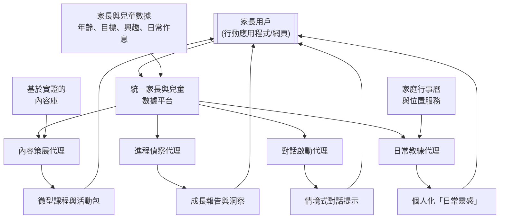
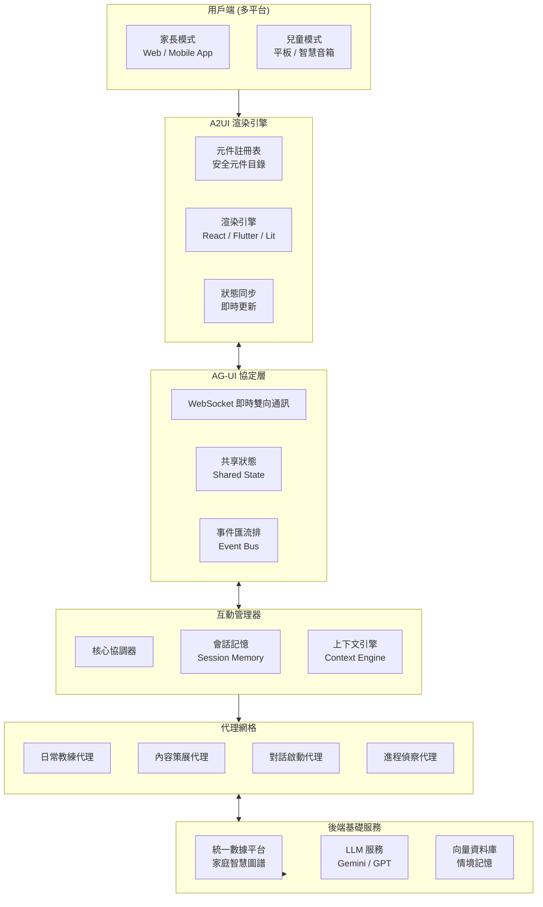

# EduMoment – Parent-Led Daily Education Platform    
## Complete System Design (English & Traditional Chinese Versions)  
  
---  
  
## Part I. English Version  
  
---  
  
## 🌱 Concept: "Parent-Led" Daily Education Platform – EduMoment  
  
The core idea is to move beyond scheduled lessons and create a system that helps parents turn everyday moments—like grocery shopping, bedtime, or a walk in the park—into educational opportunities. The platform, called **"EduMoment,"** acts as a personalized AI family coach.  
  
- **Target Audience:** Parents of children aged 2–12.    
- **Core Value Proposition:** Empower parents with the right tools, knowledge, and real-time support to confidently cultivate their child's cognitive, social-emotional, and practical life skills through daily interactions.    
- **Key Differentiator:** Unlike static parenting blogs or forums, "EduMoment" uses agentic AI to create a **dynamic, responsive, and personalized** learning ecosystem for the *parent*, which then benefits the child. It doesn’t just provide information; it actively helps parents apply it in their unique family context.  
  
---  
  
## 🏗️ Online System Design: Agentic AI Ecosystem  
  
The technical architecture is a **multi-agent system** built on a **unified data platform**, inspired by agentic enterprise models. Each AI agent has a specific job and works autonomously to support the parent.  
  
### High-Level Agent Interaction Diagram  
  
```mermaid  
flowchart TD
    A[["Parent User<br>(Mobile App / Web)"]] --> B[["Unified Parent & Child<br>Data Platform"]]
    
    B --> C[["Daily Coach Agent"]]
    B --> D[["Content Curator Agent"]]
    B --> E[["Conversation Starter Agent"]]
    B --> F[["Progress Scout Agent"]]
    
    C --> G[["Personalized 'Daily Moments' Ideas"]]
    D --> H[["Micro-Lessons & Activity Packs"]]
    E --> I[["Contextual Conversation Prompts"]]
    F --> J[["Growth Reports & Insights"]]
    
    G & H & I & J --> A
    
    K[["Parent & Child Data<br>Age, Goals, Interests, Routines"]] --> B
    L[["Evidence-Based<br>Content Library"]] --> D
    M[["Family Calendar<br>& Location Services"]] --> C

## 1. The Central Nervous System: Unified Data Platform (Concept Overview)

All agentic AI systems require a **single source of truth** to be effective. This platform securely stores and connects all family data:

- **Child Profiles:**  
  Age, developmental stage, interests (e.g., dinosaurs, space), learning goals (e.g., emotional regulation, counting), challenges (e.g., sharing, tantrums).

- **Parent Preferences:**  
  Parenting style, available time, expectations and goals for their child.

- **Family Context:**  
  Daily routines, upcoming events (doctor visits, trips), and, with permission, location data (home, grocery store, park) for contextual suggestions.

This unified data platform supports all agents: Daily Coach, Content Curator, Conversation Starter, and Progress Scout.

---

## 2. Core AI Agents

### 2.1 Daily Coach Agent

Primary interface for the parent; it proactively suggests **"Moment Ideas."**

- Example: Calendar shows a grocery trip; child’s goal is learning basic math.  
  → Suggestion:  
  **"At the store today, ask your child to help weigh apples and estimate the total cost. Here’s a simple way to explain it…"**  
  This turns a chore into a learning moment.

### 2.2 Content Curator Agent

Runs in the background using **Retrieval-Augmented Generation (RAG)** on an evidence-based library of articles, videos, and expert advice.

- Instead of a search engine, it delivers a **3-minute "micro-lesson"** for the parent:  
  topics like “handling tantrums,” “fostering curiosity,” “supporting shy children.”

### 2.3 Conversation Starter Agent

Based on research on guided conversation, it generates prompts tailored to the child’s day.

- Example:  
  **"Your child's class is studying plants this week. On the way home, ask: 'If you were a plant, what would you need to grow big and strong?'"**  
  It fosters deeper, creative thinking rather than yes/no answers.

### 2.4 Progress Scout Agent

Helps parents see the **big picture**.

- Analyzes:
  - Child’s engagement with suggested activities  
  - Parent logs (e.g., “today she calmed herself after being upset”)  
- Produces:
  - Simple growth reports  
  - Suggested next developmental goals  
  → Makes long-term progress feel manageable and motivating.

---

## 3. Key Features & Implementation (Concept Level)

- **Multi-Modal Parent Interface**
  - Mobile app for on-the-go prompts.
  - Web dashboard for deeper goal-setting and review.
  - Natural language chat interface:
    - e.g., “My 4-year-old is scared of the dark. What should I do?”  
    → Immediate, personalized advice.

- **Relational Activity Prompts**
  - Inspired by tools like the **eaSEL** model, which sparks parent–child conversations about feelings.
  - Example:  
    **"After you watch that short nature documentary together, ask your child which animal they’d like to be friends with and why."**

- **Personalized Role-Playing Scenarios**
  - Safe space for parents to practice challenging conversations.
  - Example:  
    Parent: “How do I talk to my child about not sharing?”  
    → Agent role-plays the child and offers live coaching on phrasing and tone.

- **Robust Privacy & Personalization**
  - Privacy-first architecture with granular controls.
  - Partner sharing so all caregivers stay aligned.
  - Personalization powered by the unified, secure data model.

---

## 4. Revenue Model & Go-To-Market

- **Freemium Model**
  - Free tier: daily tips, basic content library.
  - Premium: unlimited AI conversations, detailed progress tracking, multiple child profiles, personalized role-playing.

- **Content Partnerships**
  - Collaborate with child development experts and institutions.
  - License evidence-based content to power the RAG library.

- **MVP Strategy**
  - Start with a **single core agent** (e.g., Daily Coach for ages 3–6).
  - Build using platforms such as **Salesforce Agentforce for Education** to offload CRM and core agent orchestration.
  - Focus internal effort on the **unique parent experience** and content.

---

## 5. In-Depth Design Strategy: Unified Data Platform (Central Nervous System)

This unified data platform is more than a database; it is the **intelligent core** of EduMoment. Its design determines:

- How effective the AI agents are  
- How accurate personalization can be  
- How much parents trust the platform  

We’ll consider: **Data Modeling, Data Acquisition, Privacy & Security, and Data Application.**

### 5.1 Core Data Model: The Family Intelligence Graph

Instead of static user profiles, we build a **dynamic knowledge graph**, the **Family Intelligence Graph**.

#### Entities & Relationships

Core entities:

- `Parent`
- `Child`
- `Family`
- `Daily Moment`
- `Point of Interest`
- `Developmental Milestone`
- `Activity`

#### Dynamic Attributes

**Child Entity:**

- `Current Developmental Stage`  
  – e.g., Preoperational stage (Piaget), or other frameworks (e.g., SEL levels).

- `Multi-dimensional Skill Scores` (dynamic)
  - Language Expression: 7/10  
  - Emotion Identification: 5/10  
  - Mathematical Logic: 4/10  
  Updated by the **Progress Scout Agent** using logs and interactions.

- `Interest Intensity & State`
  - Interest: Dinosaurs  
    - Status: Enthusiastic  
    - Intensity: High  
  - Knowledge base:  
    - Knows herbivore/carnivore  
    - Next suggested topic: extinction theories

- `Recent Challenges`
  - e.g., Separation anxiety, unwillingness to share, bedtime resistance.

**Daily Moment Entity:**

Standardizes daily routines into AI-understandable data:

- `Type` – chores, commute, mealtime, playtime, bedtime, etc.  
- `Potential Educational Value Tags`  
  - Grocery shopping → {Math, Money, Categorization, Social Observation}  
- `Typical Duration`  
  - Breakfast → ~15 minutes  
  - Commute from school → ~20 minutes  

**Relationship Links:**

Key to the knowledge graph:

- Link `Child A`’s `Interest: Dinosaurs` with the family’s `Daily Moment: Visit to the Natural History Museum`.
- Link `Child A`’s `Challenge: Unwilling to share` with a `Content Item: Article on empathy development` currently being read by the parent.
- Link `Child A`’s `Language Expression Score` with:
  - `Activity: Dinner Story Sharing`
  - `Frequency` of this activity
  - Parent feedback on quality (“He used more details this week”).

---

### 5.2 Data Acquisition Strategy: Passive Collection + Active Guidance

Data collection must be **frictionless** and **respectful** of busy parents.

#### Passive Data Collection (Opt-out Possible)

- **Calendar & Location Integration** (with explicit consent)
  - Read family shared calendar:
    - “Soccer Practice,” “Doctor Appointment,” “Grandma’s Visit.”
  - Combine with location:
    - Recognize “at supermarket,” “in the park,” “at home.”
  - Feed into `Daily Moment` entities.

- **Interaction Log Analysis**
  - Which articles/videos do parents click most?  
  - When do they use the app (evening, commute)?  
  - Which AI suggestions they “like” or “dislike”?  
  → These signals refine personalization and UX.

#### Active, Guided Data Collection (Gamified & Value-Driven)

- **Onboarding Gamification**
  - Instead of long forms:
    - “Let’s create a profile for your little explorer! Which dinosaur are they most like?” (maps to temperament)  
    - “In which situation do you most often wish for parenting ideas?” (maps to Daily Moment types)

- **One-Tap Milestone Logging**
  - Big button: “Log a new achievement!”  
  - Example: “First time she tied her shoes by herself.”  
  - Optional short description.  
  → Gold for the **Progress Scout Agent**.

- **Feedback Loops**
  - After suggestions:
    - “Was this suggestion helpful?” [Yes / Not really]  
  - Feedback is used:
    - To evaluate suggestion quality  
    - To refine each parent’s implicit definition of “helpful”

---

### 5.3 Privacy & Security: Privacy-First Architecture

For family data, privacy is an **architectural principle**, not a feature.

#### Data Minimization & Tiered Access

- Collect **only** what is necessary for the core value.
- Implement tiered handling:
  - Precise location:
    - Used briefly for real-time suggestions (e.g., “You’re at the park, here’s a sensory game idea”).
    - After ~30 minutes, generalized to “neighborhood level” for trend analysis only.

#### On-Device Processing & Federated Learning

- **On-Device Processing**
  - Sensitive data like children’s audio/video processed locally.
  - Example:
    - Analyze emotional vocabulary in parent–child conversations locally.
    - Only upload anonymized analysis results (not raw audio).

- **Federated Learning**
  - For recommendation models:
    - Train locally on device.
    - Send only encrypted model updates (gradients) to the server.
  - Central server aggregates updates to improve models without collecting raw user data.

#### Transparency & Control Center

- **Privacy Dashboard**
  - Parents can see:
    - What data is collected
    - How it’s used
    - Example: “Your calendar data is used to suggest Daily Moments.”

- **Granular Sharing Controls**
  - “Partner Sharing” vs “Solo Mode”
  - Parents choose which child data to share with partners or caregivers.

---

### 5.4 Data Application: Fueling Agent Intelligence

The unified platform ultimately **powers** all AI agents.

#### For the Daily Coach Agent: Real-Time Context

When triggered, the Daily Coach queries the **Family Intelligence Graph**:

- **Input Example:**
  - Time: 5:00 PM  
  - Location: In car  
  - Calendar: “Just picked up from enrichment class”  
  - Child Profile:  
    - Age 4  
    - Interest: Dinosaurs  
    - Today’s mood: slightly tired (from parent note or interaction pattern)

- **Inference & Output:**
  - Recognize a “commute moment.”
  - Mood suggests **low-energy** engagement.
  - Child responds well to audio stories historically.  
  → Suggest:
  - A short dinosaur-themed listening game rather than a physical game.

#### For the Progress Scout Agent: Long-Term Insight

Periodically analyzes historical data:

- **Analysis Example:**
  - Track “Language Expression Score” over 3 months.
  - Relate to:
    - Evening reading frequency  
    - Types of books (open-ended vs. simple Q&A)  

- **Insight Example:**
  - Notice that after introducing more open-ended picture books, narrative ability improved.
  - Growth report to parent:
    - Highlight correlation.
    - Suggest experimenting with **wordless picture books** next month.

---

## 6. Modern Human–Machine Interface Strategy

The EduMoment interface is not just an operational layer; it is an **emotional bridge** between family and AI.

### 6.1 Core Philosophy: Human-Centric Conversational AI

- Move from **click-based** interfaces to **conversational** ones:
  - Parents: “My 4-year-old is afraid of the dark—what can I do?”  
  - Children: “Hey Dino Coach, why is the sky blue?”

- More than a chatbot:
  - Give the AI a consistent warm persona:
    - “Family Coach” (for parents)
    - “Virtual Buddy” (for children, e.g., a talking exploration dinosaur)

Tone and pacing should reflect **empathy, warmth, and expertise**.

---

### 6.2 Context-Aware Smart Dialogue

- **Visual & Auditory Context Integration**
  - If system detects:
    - Family is at the supermarket (calendar + location)
  - Then:
    - Show non-intrusive prompt: “Need an idea to keep your child engaged at the store?”
  - Conversation flows around:
    - Shopping, lists, comparing prices, counting items.

- **Technical Note**
  - Dialogue Manager continuously receives:
    - Time, location, recent events, interests
  - Uses those signals as dialogue state inputs to the LLM.

---

### 6.3 Multi-Modal Interaction

#### Voice-First Modes

- **Parent Mode:**
  - Voice input while cooking/driving.
  - Spoken response + text summary.

- **Child Mode:**
  - Big microphone button.
  - Natural language for questions.
  - Response with:
    - Lively tone  
    - Age-appropriate vocabulary  
    - Encouraging style

#### Visualization & Generative UI

- When explaining concepts (e.g., water cycle) or activities (e.g., baking soda volcano):
  - Show:
    - Illustrations  
    - Step-by-step cards  
    - Simple animations or interactive elements

- Backend:
  - LLM generates text + **structured UI instructions**.
- Frontend:
  - Renders charts, cards, mini-games from those instructions.

---

### 6.4 Emotional Intelligence & Personalized Warmth

#### Emotion Perception & Response

- **Parents**
  - Detect stress/anxiety in:
    - Text phrasing
    - Voice (with consent)
  - Respond more supportively:
    - “Sounds like today has been tough. Let’s take this step by step…”

- **Children**
  - Virtual buddy:
    - Adjusts facial expression and tone based on:
      - Excitement
      - Confusion
      - Frustration
    - Celebrates successes; patiently re-explains when needed.

#### Evolving Personalized Persona

- Over time:
  - AI remembers child’s:
    - Preferences
    - Common phrases
    - Past topics
  - Example:
    - “Hey Leo, remember our T-Rex conversation? It was a great dinosaur hunter—just like how you’re hunting for answers today!”

---

### 6.5 Human–AI Collaboration & Control

- **Transparent AI Identity**
  - Clear branding (name/avatar/intro) so users know they’re talking to AI.

- **Seamless Human Handoff**
  - “Ask an Expert” button to escalate:
    - Conversation context (with consent) is passed to a human parenting consultant.

- **Parent Backstage View**
  - Summaries of:
    - Topics child has been curious about
    - Types of questions asked
  - No invasive monitoring; designed to reassure and support.

---

## 7. Modern HMI Implementation Architecture (Generative UI Driven)

EduMoment’s HMI is built as a **Generative UI–driven, multi-agent, event‑driven system**.

### 7.1 High-Level Architecture (Event-Driven Interaction Manager)

```mermaid
flowchart TB
    subgraph User["Client Side (Multi-Platform)"]
        direction TB
        P[Parent Mode<br/>Web / Mobile App]
        C[Child Mode<br/>Tablet / Smart Speaker]
    end

    subgraph A2UI["A2UI Rendering Engine"]
        direction LR
        CR[Component Registry<br/>Safe Component Catalog]
        RE[Rendering Engine<br/>React / Flutter / Lit]
        SM[State Sync<br/>Real-time Updates]
    end

    subgraph AGUI["AG-UI Protocol Layer"]
        direction LR
        WS[WebSocket Bidirectional]
        SS[Shared State]
        EV[Event Bus]
    end

    subgraph InteractionManager["Interaction Manager"]
        direction TB
        IM[Core Coordinator]
        SM_IM[Session Memory]
        CE[Context Engine]
    end

    subgraph AgentMesh["Agent Mesh"]
        direction TB
        DC[Daily Coach Agent]
        CC[Content Curator Agent]
        CS[Conversation Starter Agent]
        PS[Progress Scout Agent]
    end

    subgraph BackendServices["Backend Infrastructure"]
        direction TB
        UD[Unified Data Platform<br/>Family Intelligence Graph]
        LLM[LLM Services<br/>Gemini / GPT]
        VDB[Vector Database<br/>Contextual Memory]
    end

    User --> A2UI
    A2UI <--> AGUI
    AGUI <--> InteractionManager
    InteractionManager --> AgentMesh
    AgentMesh <--> BackendServices
    BackendServices -.-> UD
```

---

### 7.2 A2UI Rendering Engine

- **Security**
  - UI defined as **declarative JSON**, not executable code.
  - Client maintains a **Safe Component Catalog**:
    - e.g., Card, Button, Chart, Image
  - Agents *only* reference these components.

- **LLM-Friendly, Framework-Agnostic**
  - Flat component lists with IDs.
  - Same JSON works with React, Flutter, SwiftUI.

**Example UI Spec Generated by Agent:**

```json
{
  "components": [
    { "id": "c1", "type": "Card", "props": { "title": "The Magic of Light" } },
    { "id": "c2", "type": "Image", "props": { "url": "scattering_diagram.png" } },
    { "id": "c3", "type": "Button", "props": { "text": "Try an Experiment", "action": "show_experiment" } }
  ]
}
```

---

### 7.3 AG-UI Protocol Layer

- Standard protocol to let agents:
  - React to UI events (clicks, gestures, navigation).
  - Update shared state.
  - Use **Frontend Tools**:
    - Fill forms
    - Navigate pages
    - Highlight UI elements

---

### 7.4 Interaction Manager

Based on NVIDIA’s pattern:

- **Event-Driven**
  - All interactions (voice, taps, drags) → events.
- **Context-Aware**
  - Uses the Family Intelligence Graph and real-time signals.
- **Multi-Agent Coordination**
  - Routes tasks to:
    - Daily Coach  
    - Content Curator  
    - Conversation Starter  
    - Progress Scout  

---

### 7.5 Agentic AI Patterns

#### Mixed-Initiative Design (HAX-Inspired)

- **Intent Preview**
  - “Tomorrow at 8:00, I’ll send a math game idea for your grocery trip. OK?”  

- **Iterative Alignment**
  - Parent: “Too hard; simplify it.”  
  - Agent adjusts and regenerates.

- **Trust Repair**
  - If an answer is off:
    - Explain limits
    - Offer correction & alternative suggestion.

#### Narrative Consistency Across Agents

- Behavioral proxy ensures:
  - **Tone**: warm, professional, encouraging.
  - **Memory**: child’s earlier question in Child Mode can be referenced in Parent Mode later.

---

### 7.6 Technology Stack

#### Frontend

| Component          | Tech                       |
|-------------------|----------------------------|
| Web Frontend      | Next.js + React + TypeScript |
| Mobile App        | Flutter                    |
| Child Mode        | Flutter (Web/Tablet)       |
| UI Components     | CopilotKit React components |
| Generative UI     | A2UI + AG-UI client        |
| State Management  | Redux Toolkit / Riverpod   |
| Voice Interface   | Web Speech API / Flutter TTS |

#### Backend

| Component              | Tech                             |
|------------------------|----------------------------------|
| API Gateway            | Node.js + Express / FastAPI      |
| Real-Time Communication| WebSocket + Socket.io            |
| LLM Services           | Google ADK + Gemini / OpenAI     |
| Agent Framework        | LangChain / LangGraph            |
| Vector Database        | Pinecone / Weaviate              |
| Unified Data Platform  | PostgreSQL + Neo4j               |
| Event Streaming        | Apache Kafka                     |

#### DevOps & Infrastructure

| Component     | Tech                     |
|--------------|--------------------------|
| Containerization | Docker + Kubernetes  |
| CI/CD        | GitHub Actions           |
| Monitoring   | Prometheus + Grafana     |
| Logging      | ELK Stack                |

---

### 7.7 Implementation Roadmap

**Phase 1: MVP (3 Months)**  
- Single agent (Daily Coach) with text-based chat.  
- Next.js + basic ADK-based backend.  
- Basic auth and storage.

**Phase 2: Voice & Generative UI (2 Months)**  
- Voice input/output.  
- Introduce A2UI for simple activity cards.  
- Conversation summary dashboard for parents.

**Phase 3: Child Mode & Multi-Agent (3 Months)**  
- Flutter-based child interface.  
- Launch “Dino Coach” character.  
- Full agent mesh: Daily Coach, Curator, Conversation Starter, Progress Scout.

**Phase 4: Emotion & Personalization (2 Months)**  
- Sentiment analysis & tone adaptation.  
- Personalized memory per child.  
- Mixed-initiative patterns (intent preview, alignment).  
- Full public launch.

---

### 7.8 Security & Privacy Highlights

- **On-Device First** for children’s audio.  
- **Safe Component Catalog** for A2UI-generated UI.  
- **Data Minimization** and transparent **Privacy Dashboard**.  

---

## Part II. Traditional Chinese Version（繁體中文版本）

---

## 🌱 核心概念：「父母主導」的日常教育平台 – 教養時光（EduMoment）

這個理念的核心，是超越預定好的課程表，建立一個系統，幫助父母把每天的生活片刻——例如買菜、睡前故事、在公園散步——轉化為孩子的學習機會。這個平台名為 **「教養時光」 (EduMoment)**，扮演的是一位**個人化的 AI 家庭教練**。

- **目標受眾：** 2–12 歲孩子的父母。  
- **核心價值主張：** 透過日常互動，給父母合適的工具、知識與即時支援，讓他們能自信地培養孩子的認知能力、社交情感能力及生活實作技能。  
- **主要差異化特點：** 不同於靜態的育兒部落格或論壇，「教養時光」運用代理式 AI，為*父母*打造一個**動態、回應式且個人化**的學習生態系統，進而惠及孩子。它不只是給資訊，而是主動幫助父母在各自獨特的家庭情境中「用得出來」。

---

## 🏗️ 線上系統設計：代理式 AI 生態系統

技術架構為一個建立在**統一數據平台**上的**多代理系統**，靈感來自「代理式企業」的概念。每個 AI 代理都有明確職責，自主運作、彼此協作，以支持父母。

### 系統代理互動示意圖



---

## 1. 中樞神經系統：統一數據平台（概念總覽）

所有代理式 AI 系統要有效運作，都需要一個**單一事實來源**。這個平台會安全地儲存並串聯家庭相關的所有數據：

- **兒童檔案：**  
  年齡、發展階段、興趣（恐龍、太空…）、學習目標（情緒調節、數數…）、目前挑戰（不願分享、易發脾氣…）。

- **家長偏好：**  
  教養風格、可運用時間、對孩子的長期期望與目標。

- **家庭情境：**  
  日常作息、即將到來的活動（看醫生、旅行）、在取得授權後可使用的位置資訊（在家、超市、公園等）。

這個統一數據平台，是所有代理（教練、策展、對話啟動、進程偵察）的共同基礎。

---

## 2. 核心 AI 代理

### 2.1 日常教練代理

與家長互動的主要界面，主動提供**「日常靈感」**。

- 範例：  
  行事曆顯示今天要去超市，孩子的目標是練習基礎數學 →  
  代理建議：  
  **「今天在超市，可以請孩子幫忙稱蘋果，估算總價。這裡有一個適合 4 歲孩子的簡單說法…」**  
  讓原本的家務變成學習機會。

### 2.2 內容策展代理

在後台運作，使用 **RAG（檢索增強生成）** 技術，從大量基於實證的文章、影片與專家內容中篩選。

- 不用搜尋引擎「丟一堆連結」，而是為家長生成**3 分鐘「微型課程」**：  
  主題可能是：「面對孩子發脾氣」、「如何培養好奇心」、「如何陪伴害羞的孩子」。

### 2.3 對話啟動代理

基於「引導式對話」的研究，為親子互動設計**量身定做的對話開場**。

- 範例：  
  **「您孩子的班級本週在學植物，回家路上可以問：『如果你是一棵植物，你需要什麼才會長得又高又壯？』」**  
  不只是問「今天在學校怎麼樣？」而是鼓勵更深層、有創造力的思考。

### 2.4 進程偵察代理

幫助父母看見孩子成長的**全貌**。

- 分析：
  - 孩子對活動的參與度與回饋  
  - 父母自行紀錄（例如「今天他自己冷靜下來了」）  
- 產出：
  - 簡明的成長報告  
  - 建議下一個合適的發展目標  
  → 讓長期教養旅程變得有方向、可掌握。

---

## 3. 主要功能與實作方向（概念層）

- **多模式家長介面**
  - 行動 App：即時提示與對話。  
  - 網頁儀表板：深度目標設定、回顧成長。  
  - 自然語言聊天：
    - 例：「我 4 歲的孩子怕黑，我該怎麼辦？」  
    → 即時、個人化建議。

- **「關係型」活動提示**
  - 可借鑑如 **eaSEL 模型**，促進親子在觀看螢幕後討論感受。  
  - 範例：  
    **「一起看完這部自然紀錄短片後，可以問孩子：『你想跟哪一種動物當朋友？為什麼？』」**

- **個人化角色扮演情境**
  - 為家長提供安全的「練習場」。  
  - 範例：  
    家長：「我要怎麼跟孩子談分享玩具？」  
    → 代理扮演孩子，進行對話演練，並即時提示更有效的說法與語氣。

- **強大的隱私與個人化**
  - 以「隱私優先」為架構原則。  
  - 提供精細的權限與共享設定（例如與伴侶共享）。  
  - 所有個人化能力由安全、統一的數據模型驅動。

---

## 4. 營收模式與起步策略

- **Freemium 模式**
  - 免費版：每日提示 + 基本內容庫。  
  - 付費版：無限 AI 對話、詳細成長追蹤、多位孩子檔案、個人化角色扮演等。

- **內容合作**
  - 與兒童發展專家、機構合作，引進與授權高品質、基於實證的內容，作為 RAG 內容庫基礎。

- **MVP 建議**
  - 先聚焦一個核心代理（例如 3–6 歲的「日常教練」）。  
  - 利用像 Salesforce Agentforce for Education 這類平台，處理 CRM 與代理邏輯。  
  - 團隊則集中火力打造**差異化的家長體驗與教養內容**。

---

## 5. 深度設計策略：統一數據平台（中樞神經系統）

這個統一數據平台是「教養時光」的**智慧核心**，決定：

- 代理運作的效果  
- 個人化的精準程度  
- 家長對平台的信任程度  

從四個面向說明：**數據模型、數據獲取、隱私安全、數據應用**。

### 5.1 核心數據模型：動態的「家庭智慧圖譜」

不同於僅有靜態欄位的使用者檔案，我們打造一個動態互連的**知識圖譜**：**「家庭智慧圖譜」**。

#### 實體與關係

主要實體包括：

- `家長`  
- `孩子`  
- `家庭`  
- `日常時刻`  
- `興趣點`  
- `發展里程碑`  
- `活動`  

#### 動態屬性

**孩子實體：**

- `當前發展階段`  
  - 例如：依皮亞傑理論為「前運思期」，或其他發展框架（如社交情緒發展層級）。

- `多維度能力分數`（隨時間更新）  
  - 語言表達：7/10  
  - 情緒辨識：5/10  
  - 數理邏輯：4/10  
  由「進程偵察代理」分析互動記錄動態更新。

- `興趣強度與狀態`  
  - 興趣：恐龍  
    - 狀態：狂熱  
    - 強度：高  
  - 知識狀態：  
    - 已了解草食/肉食  
    - 下一步建議：滅絕理論

- `最近挑戰`  
  - 如：分離焦慮、不願分享、入睡困難等。

**日常時刻實體：**

將家庭日常行程標準化為 AI 可理解的資料：

- `類型`  
  - 家務、通勤、用餐、遊戲、就寢等。

- `潛在教育價值標籤`  
  - 如超市購物 → {數學、金錢觀、分類、社會觀察}

- `典型持續時間`  
  - 早飯 ~15 分鐘  
  - 放學車程 ~20 分鐘  

**關係連結：**

知識圖譜的關鍵：

- 將 `孩子A` 的 `興趣: 恐龍` 與家庭即將發生的 `日常時刻: 自然博物館參觀` 連結。  
- 將 `孩子A` 的 `挑戰: 不願分享` 與家長正在閱讀的 `內容: 關於同理心發展的文章` 連結。  
- 將 `孩子A` 的 `語言表達分數` 與其參與的 `活動: 晚餐故事分享` 的 `頻率` 和`家長回饋品質` 建立關聯。

---

### 5.2 數據獲取策略：被動收集與主動引導並行

需在「不打擾、不中斷父母生活」的前提下，建立上述圖譜。

#### 被動數據收集（預設開啟，可選關閉）

- **行事曆與位置整合**（須明確授權）
  - 從家庭行事曆讀取事件：足球課、看醫生、與祖父母聚會等。  
  - 搭配位置服務，辨識：在超市、公園、家裡。  
  - 為 `日常時刻` 實體提供原始資料。

- **互動日誌分析**
  - 分析：  
    - 家長最常閱讀的主題  
    - 典型使用時間  
    - 對哪類 AI 建議按「喜歡/不喜歡」  
  → 為個人化調整與產品優化提供關鍵訊號。

#### 主動引導式數據收集（遊戲化、價值驅動）

- **入職引導遊戲化**
  - 取代冗長表單，改用互動問答：  
    - 「讓我們一起為你的小探險家建立檔案！他最像哪一種恐龍？」（對應不同氣質）  
    - 「你最常在哪種情況，覺得需要一點教養靈感？」（對應不同日常時刻類型）

- **「一鍵里程碑紀錄」**
  - 顯眼按鈕：「按一下，記錄新成就！」  
  - 例如：「第一次自己綁鞋帶」  
  - 可選填簡短描述。  
  → 是「進程偵察代理」的重要養分。

- **回饋閉環**
  - 每次 AI 建議後簡問：「這個建議實用嗎？」[有用 / 普通]  
  - 用於：
    - 評估建議品質  
    - 了解「對這位家長而言，何謂實用」並持續微調。

---

### 5.3 隱私與安全：以「隱私優先」為核心的架構

對家庭數據而言，隱私不是附加功能，而是**整體架構原則**。

#### 數據最小化與分級存取

- 僅收集提供核心價值「絕對必要」的資料。  
- 實施分級處理：
  - 精準位置：
    - 只短暫用於情境建議（如「你在公園，試試這個感官遊戲」）  
    - ~30 分鐘後模糊化為「社區層級」，僅供長期趨勢分析。

#### 本地處理與聯邦學習

- **本地優先處理**
  - 涉及語音/影音的敏感資料在裝置端分析。  
  - 例如：  
    - 在手機上分析親子對話中的情緒詞彙，只上傳匿名化分析結果，而非原始錄音。

- **聯邦學習**
  - 對於需大量資料訓練的模型（例如內容推薦）：  
    - 模型在裝置端學習。  
    - 只回傳加密後的模型更新（梯度），不回傳原始資料。  
  - 伺服器聚合更新，提升模型能力，同時保障隱私。

#### 透明控制台

- **隱私控制台**
  - 家長可以一目了然：
    - 目前收集哪些數據  
    - 用於何種功能  
    - 例：「您的行事曆資料用於提供日常靈感建議」

- **精細共享設定**
  - 區分「伴侶共享」與「個人模式」。  
  - 家長可選擇哪些孩子資料與伴侶或其他照顧者共享。

---

### 5.4 數據應用：為代理提供高品質「燃料」

統一數據平台的目的，是**驅動所有 AI 代理**。

#### 提供日常教練代理情境資訊

當日常教練被觸發時，會查詢「家庭智慧圖譜」：

- **輸入示例：**
  - 時間：下午 5 點  
  - 位置：車上  
  - 行事曆：剛下課，從才藝班回程  
  - 兒童檔案：  
    - 年齡 4 歲  
    - 興趣：恐龍  
    - 今日情緒：稍微疲憊（根據父母紀錄或互動模式）

- **判斷與輸出：**
  - 辨識為「通勤時刻」。  
  - 情況適合低能耗互動。  
  - 過往經驗顯示孩子喜歡聽故事。  
  → 推薦：簡短的恐龍聽力小遊戲，而非高體力活動。

#### 為進程偵察代理提供長期洞察

定期分析歷史軌跡：

- **分析示例：**
  - 比對近 3 個月「語言表達分數」變化  
  - 以及晚間共讀頻率、書籍類型（開放式 vs. 問答式）  

- **洞察示例：**
  - 發現增加「開放式繪本」後，敘事能力明顯提升。  
  - 在成長報告中：
    - 強調此正向關聯  
    - 建議下個月可多試「無字圖畫書」激發想像力。

---

## 6. 現代化人機介面策略：打造有溫度的家庭對話夥伴

在「教養時光」中，介面不只是操作工具，而是一座**連結家庭與 AI 的情感橋樑**。

### 6.1 核心哲學：以人為本的對話式 AI

- 從**點按式介面**轉向**對話式介面**：  
  - 父母：「我 4 歲的孩子怕黑，我可以怎麼引導？」  
  - 孩子：「小恐龍教練，為什麼天空是藍色的？」  

- 不只是 Chatbot，而是一位「有個性」的夥伴：
  - 父母端：溫暖、專業的「家庭教練」  
  - 兒童端：可愛的「虛擬夥伴」（例如會說話的小恐龍）

---

### 6.2 情境感知的智慧對話框

- **視覺與聽覺上下文整合**
  - 當系統透過行事曆與定位判斷「全家正在超市」時：  
    - 顯示不打擾的小提醒：「需要一個可以在超市讓孩子參與的點子嗎？」  
  - 若家長回應，對話即自動圍繞：  
    - 購物、清單、價格比較、分類等具體情境。

- **技術層面**
  - 對話管理模型持續接收：  
    - 時間、地點、近期事件、孩子興趣  
  - 將這些訊號作為對話狀態，餵給 LLM 產生情境化回應。

---

### 6.3 多模態互動體驗

#### 語音優先模式

- **父母模式：**
  - 支援語音輸入，方便在開車或做飯時提問。  
  - 系統以語音回覆，並附上文字摘要。

- **兒童模式：**
  - 大型麥克風按鈕，一點就能提問。  
  - 回應以：  
    - 生動語調  
    - 符合年齡的語彙  
    - 充滿鼓勵的語氣  
  → 鼓勵孩子多發問、多表達。

#### 視覺化與生成式 UI

- 當解釋科學概念（例如「水循環」）或示範活動（例如「火山爆發實驗」）時：  
  - 不只給文字，而是搭配：  
    - 插圖  
    - 分步驟卡片  
    - 簡易動畫或互動元件  

- 後端：
  - AI 生成文字 + 結構化 UI 指令。  
- 前端：
  - 將這些指令渲染為圖表、卡片、小遊戲等。

---

### 6.4 情感運算與個人化溫度

#### 情緒感知與回應

- **對父母：**
  - 分析輸入文字或（經同意）語音的情緒線索。  
  - 若偵測到焦慮或挫折：  
    - 回覆採更溫和支援式語氣：  
      - 「聽起來今天有點不容易，我們一步一步來。關於孩子的情緒，我有幾個很簡單的起手式可以分享…」

- **對孩子：**
  - 虛擬夥伴的表情（若有角色 UI）與語氣隨孩子反應調整：  
    - 答對問題 → 歡呼與動畫慶祝  
    - 顯得困惑 → 用更簡單、更多例子重新說明  

#### 持續進化的個人化人格

- 隨著互動累積，AI 會「記住」孩子的：  
  - 喜好  
  - 常用說法  
  - 過往對話主題  

- 例如：  
  - 「小樂，你還記得我們上次聊的暴龍嗎？牠是超厲害的恐龍獵人，就像你現在在追尋答案一樣！」

---

### 6.5 人機協作邊界與可控性

- **清楚的 AI 身份**
  - 以名稱、頭像或開場介紹，讓使用者明白正在與 AI 對話。

- **人類專家接手機制**
  - 對話介面提供「請教專家」按鈕：  
    - 經家長同意後，將對話脈絡傳給平台上的真人育兒顧問。

- **給父母的「後台視角」**
  - 顯示 AI 與孩子互動的摘要：  
    - 孩子最近關心哪些主題  
    - 常問什麼類型的問題  
  - 不做侵入式監控，只讓父母更了解孩子、對 AI 互動感到安心。

---

## 7. 現代化人機介面實作架構（生成式 UI 驅動）

「教養時光」的人機介面，採用**生成式 UI、多代理、事件驅動**的整體架構。

### 7.1 整體架構圖（事件驅動互動管理器）



---

### 7.2 A2UI 渲染引擎

- **安全性**
  - UI 以「宣告式 JSON」表示，而非可執行程式碼。  
  - 客戶端維護「安全元件目錄」，包含：Card、Button、Chart、Image 等。  
  - 代理只能引用這些元件，避免 UI 注入攻擊。

- **LLM 友好、框架無關**
  - 元件以扁平列表 + ID 表示。  
  - 相同的 JSON 可以在 React、Flutter、SwiftUI 中渲染。

**代理生成的 UI 範例：**

```json
{
  "components": [
    { "id": "c1", "type": "Card", "props": { "title": "光的魔法" } },
    { "id": "c2", "type": "Image", "props": { "url": "scattering_diagram.png" } },
    { "id": "c3", "type": "Button", "props": { "text": "做個小實驗", "action": "show_experiment" } }
  ]
}
```

---

### 7.3 AG-UI 協定層

- 標準化代理與前端的互動：  
  - 代理可以感知 UI 事件（點擊、滑動、頁面切換）。  
  - 可以更新共享狀態。  
  - 可以使用「前端工具」：填表單、切換頁面、標註畫面元素等。

---

### 7.4 互動管理器（Interaction Manager）

參考 NVIDIA 架構模式：

- **事件驅動**
  - 所有互動（語音、點擊、拖曳）都轉為事件。  

- **情境感知**
  - 使用家庭智慧圖譜和即時訊號了解當下情境。  

- **多代理協調**
  - 將需求分派給：  
    - 日常教練  
    - 內容策展  
    - 對話啟動  
    - 進程偵察  

---

### 7.5 代理式 AI 設計模式

#### 混合主動設計（Mixed-Initiative）

- **意圖預覽**
  - 「明天早上 8 點，我會給你一個在超市玩的數學遊戲點子，可以嗎？」  

- **疊代對齊**
  - 家長：「這活動對我孩子太難了，簡單一些。」  
  - 代理即時重新生成簡化版本。

- **信任修復**
  - 當建議不準確：  
    - 說明限制  
    - 提供修正與替代方案。

#### 多代理敘事一致性

- 透過「行為代理」協調：  
  - **語氣一致**：溫暖、專業、鼓勵。  
  - **記憶一致**：  
    - 孩子白天在兒童模式問的問題，晚間父母詢問時，代理能自然提及。

---

### 7.6 開發技術棧

#### 前端

| 組件           | 技術                 |
|----------------|----------------------|
| Web 前端       | Next.js + React + TypeScript |
| 行動 App       | Flutter              |
| 兒童模式       | Flutter (Web/平板)   |
| UI 元件庫      | CopilotKit React 元件 |
| 生成式 UI      | A2UI + AG-UI 客戶端  |
| 狀態管理       | Redux Toolkit / Riverpod |
| 語音介面       | Web Speech API / Flutter TTS |

#### 後端

| 組件                | 技術                           |
|---------------------|--------------------------------|
| API Gateway         | Node.js + Express / FastAPI    |
| 即時通訊            | WebSocket + Socket.io          |
| LLM 服務            | Google ADK + Gemini / OpenAI   |
| 代理框架            | LangChain / LangGraph          |
| 向量資料庫          | Pinecone / Weaviate            |
| 統一數據平台        | PostgreSQL + Neo4j             |
| 事件流處理          | Apache Kafka                   |

#### DevOps 與基礎設施

| 組件      | 技術                     |
|-----------|--------------------------|
| 容器化    | Docker + Kubernetes      |
| CI/CD     | GitHub Actions           |
| 監控      | Prometheus + Grafana     |
| 日誌收集  | ELK Stack                |

---

### 7.7 實作路線圖

**第一階段：MVP（約 3 個月）**  
- 單一代理（日常教練）+ 文字對話。  
- Next.js 前端 + ADK 後端雛形。  
- 基礎帳號系統與資料儲存。

**第二階段：語音與生成式 UI（約 2 個月）**  
- 整合語音輸入/輸出。  
- 使用 A2UI 實作簡單活動卡片。  
- 建立「統一 AI 語氣指南」。  
- 開發父母端對話摘要後台。

**第三階段：兒童模式與多代理（約 3 個月）**  
- Flutter 兒童介面。  
- 上線「小恐龍教練」角色。  
- 四大核心代理完整協作。

**第四階段：情感運算與個人化（約 2 個月）**  
- 情緒分析與語氣調整。  
- 為每位孩子建立個人化記憶。  
- 導入混合主動設計（意圖預覽、疊代對齊）。  
- 完整上線。

---

### 7.8 安全與隱私重點

- **本地優先處理**：兒童語音在裝置端分析。  
- **安全元件目錄**：A2UI 保證動態 UI 不導入惡意程式碼。  
- **資料最小化**與透明的**隱私控制台**。

---

## 結語 / Conclusion

透過上述的概念設計、統一數據平台、現代化人機介面與生成式 UI 架構，「教養時光 / EduMoment」可以真正成為一位**有溫度的家庭 AI 夥伴**——讓科技隱於無形，讓父母與孩子的互動回歸自然、有愛又富有學習意義。
```

Do you want this Markdown structured as a single file in your repo (e.g., `docs/edumoment-system-design.md`) or split into separate English and Chinese documents later?
