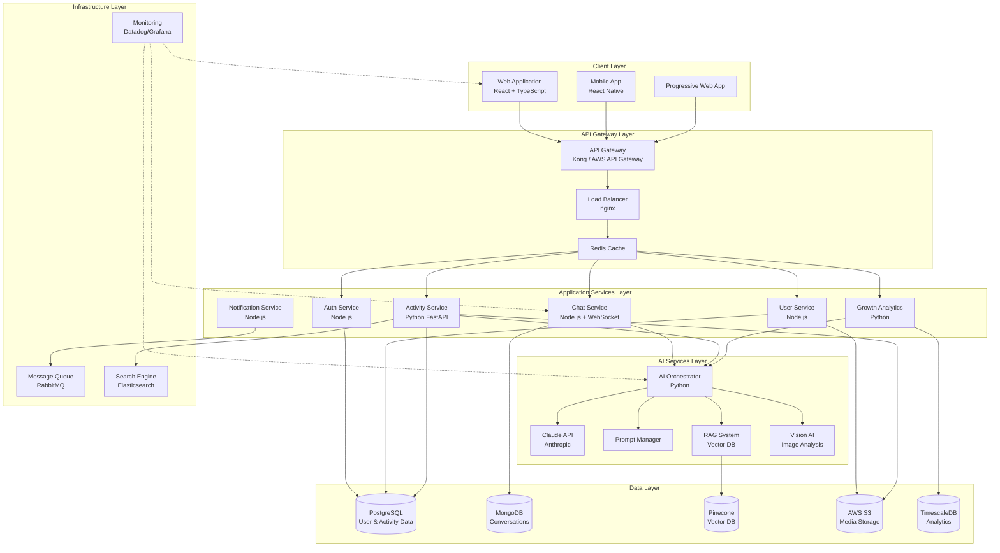
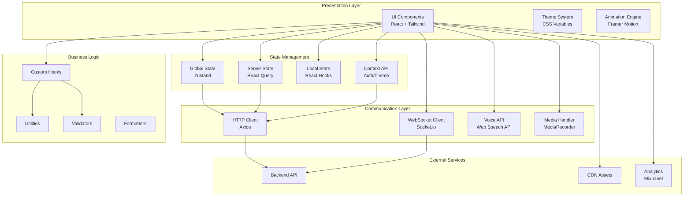
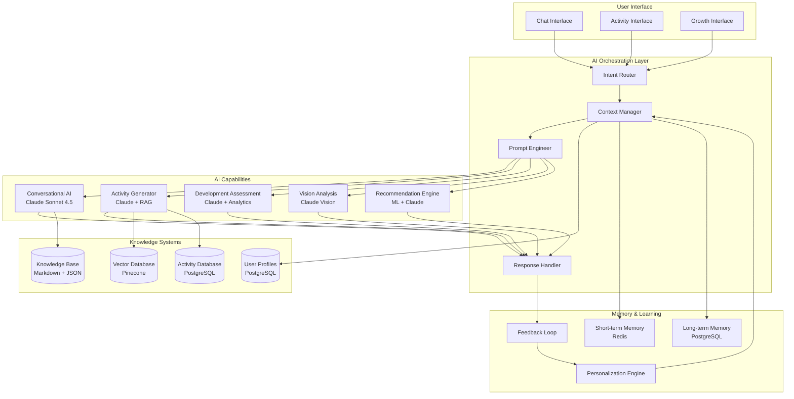
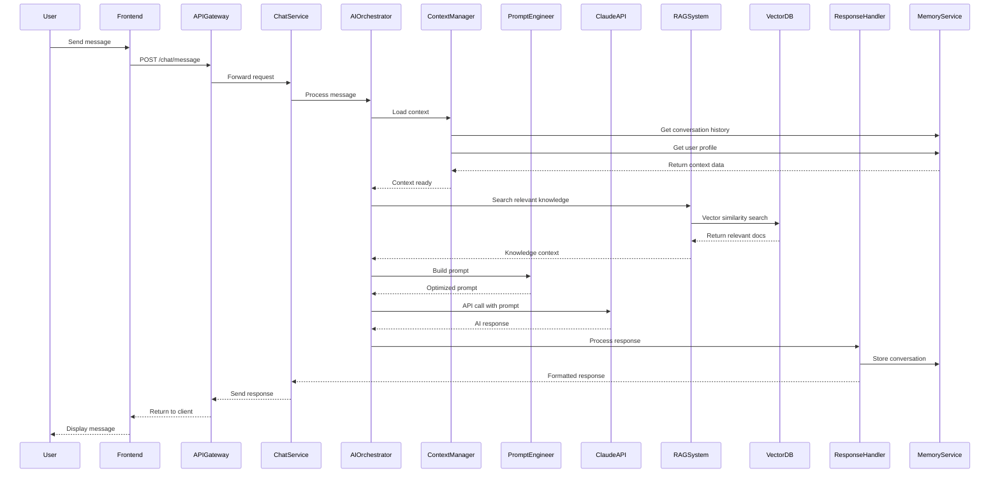

# Modern Human-Machine Interface - Complete Implementation Architecture

Let me provide you with a comprehensive, production-ready implementation architecture with detailed system diagrams, technology stack, and AI integration strategies.

---

## I. System Architecture Overview

### 1.1 High-Level System Architecture



### 1.2 Frontend Architecture Diagram



### 1.3 AI Orchestration Architecture



---

## II. Detailed Technology Stack

### 2.1 Frontend Technology Stack

```yaml
Frontend Stack:
  Framework:
    - React: 18.3.1
    - TypeScript: 5.3.3
    - React Native: 0.73.x (Mobile)
    
  UI & Styling:
    - Tailwind CSS: 3.4.x
    - Radix UI: 1.3.x (Accessible primitives)
    - Framer Motion: 11.x (Animations)
    - Lucide React: 0.344.x (Icons)
    - React Spring: 9.7.x (Physics-based animations)
    
  State Management:
    - Zustand: 4.5.x (Global state)
    - React Query: 5.x (Server state)
    - Jotai: 2.6.x (Atomic state)
    
  Routing:
    - React Router: 6.x (Web)
    - React Navigation: 6.x (Mobile)
    
  Forms & Validation:
    - React Hook Form: 7.x
    - Zod: 3.x (Schema validation)
    
  Voice & Media:
    - Web Speech API (Built-in)
    - MediaRecorder API (Built-in)
    - Wavesurfer.js: 7.x (Audio visualization)
    - React Webcam: 7.x (Camera access)
    
  Real-time Communication:
    - Socket.io Client: 4.x
    - WebRTC (Built-in)
    
  Data Visualization:
    - Recharts: 2.x
    - D3.js: 7.x
    - Victory: 36.x
    
  Testing:
    - Vitest: 1.x (Unit tests)
    - Testing Library: 14.x
    - Playwright: 1.x (E2E tests)
    - Storybook: 7.x (Component development)
    
  Build Tools:
    - Vite: 5.x (Build tool)
    - ESBuild: 0.19.x (Bundler)
    - SWC: 1.x (TypeScript compiler)
    
  Code Quality:
    - ESLint: 8.x
    - Prettier: 3.x
    - Husky: 9.x (Git hooks)
    - Lint-staged: 15.x
    
  PWA:
    - Workbox: 7.x (Service worker)
    - Web App Manifest
    
  Analytics & Monitoring:
    - Mixpanel: 2.x (Product analytics)
    - Sentry: 7.x (Error tracking)
    - LogRocket: 8.x (Session replay)
```

### 2.2 Backend Technology Stack

```yaml
Backend Stack:
  API Services:
    Core Services (Node.js):
      - Node.js: 20.x LTS
      - Express: 4.x
      - TypeScript: 5.x
      - Socket.io: 4.x (WebSocket)
      
    AI Services (Python):
      - Python: 3.11.x
      - FastAPI: 0.109.x
      - Pydantic: 2.x (Data validation)
      - Anthropic SDK: 0.18.x
      
  API Gateway:
    - Kong: 3.x
    - OR AWS API Gateway
    - Rate Limiting: Redis
    
  Authentication:
    - JWT: jsonwebtoken 9.x
    - Passport.js: 0.7.x
    - OAuth 2.0: NextAuth.js 4.x
    - 2FA: speakeasy 2.x
    
  Databases:
    Primary Database:
      - PostgreSQL: 16.x
      - Prisma ORM: 5.x (Node.js)
      - SQLAlchemy: 2.x (Python)
      
    Document Store:
      - MongoDB: 7.x
      - Mongoose: 8.x
      
    Vector Database:
      - Pinecone (Managed)
      - OR Weaviate: 1.24.x (Self-hosted)
      - OR Qdrant: 1.7.x (Self-hosted)
      
    Time-series:
      - TimescaleDB: 2.x (PostgreSQL extension)
      
    Cache:
      - Redis: 7.x
      - Redis OM: 0.2.x (Object mapping)
      
    Search:
      - Elasticsearch: 8.x
      - OR Meilisearch: 1.6.x (Lightweight alternative)
      
  Storage:
    - AWS S3 (Primary)
    - CloudFlare R2 (Alternative)
    - MinIO (Self-hosted)
    
  Message Queue:
    - RabbitMQ: 3.12.x
    - OR AWS SQS
    - Bull: 4.x (Redis-based queue for Node.js)
    
  AI & ML:
    - Anthropic Claude API
    - LangChain: 0.1.x (Orchestration)
    - LlamaIndex: 0.10.x (RAG framework)
    - Sentence Transformers: 2.x (Embeddings)
    
  Background Jobs:
    - Bull: 4.x (Node.js)
    - Celery: 5.x (Python)
    
  Monitoring & Logging:
    - Datadog (Managed)
    - OR Grafana + Prometheus (Self-hosted)
    - Winston: 3.x (Logging - Node.js)
    - Loguru: 0.7.x (Logging - Python)
    - Sentry: 7.x (Error tracking)
    
  Testing:
    - Jest: 29.x (Node.js)
    - Pytest: 8.x (Python)
    - Supertest: 6.x (API testing)
    - Locust: 2.x (Load testing)
```

### 2.3 Infrastructure & DevOps Stack

```yaml
Infrastructure:
  Cloud Platform:
    Primary: AWS
    Alternatives:
      - Google Cloud Platform
      - Microsoft Azure
      
  Containerization:
    - Docker: 24.x
    - Docker Compose: 2.x
    
  Orchestration:
    - Kubernetes: 1.29.x
    - Helm: 3.x (Package manager)
    
  CI/CD:
    - GitHub Actions
    - OR GitLab CI
    - OR Jenkins
    
  Infrastructure as Code:
    - Terraform: 1.7.x
    - OR Pulumi: 3.x
    
  CDN:
    - CloudFlare
    - OR AWS CloudFront
    
  Domain & DNS:
    - CloudFlare DNS
    - OR Route 53
    
  SSL/TLS:
    - Let's Encrypt (Free)
    - AWS Certificate Manager
    
  Backup:
    - AWS Backup
    - Automated PostgreSQL backups
    - S3 versioning
    
  Security:
    - AWS WAF (Web Application Firewall)
    - Snyk (Dependency scanning)
    - OWASP ZAP (Security testing)
```

---

## III. Detailed Implementation Architecture

### 3.1 Frontend Application Structure

```
frontend/
├── public/
│   ├── index.html
│   ├── manifest.json
│   ├── service-worker.js
│   └── assets/
│       ├── icons/
│       ├── images/
│       └── fonts/
│
├── src/
│   ├── app/
│   │   ├── App.tsx
│   │   ├── Routes.tsx
│   │   └── providers/
│   │       ├── AuthProvider.tsx
│   │       ├── ThemeProvider.tsx
│   │       ├── QueryProvider.tsx
│   │       └── SocketProvider.tsx
│   │
│   ├── features/
│   │   ├── auth/
│   │   │   ├── components/
│   │   │   │   ├── LoginForm.tsx
│   │   │   │   ├── SignupForm.tsx
│   │   │   │   └── SocialAuth.tsx
│   │   │   ├── hooks/
│   │   │   │   ├── useAuth.ts
│   │   │   │   └── useSession.ts
│   │   │   ├── api/
│   │   │   │   └── authApi.ts
│   │   │   └── types/
│   │   │       └── auth.types.ts
│   │   │
│   │   ├── dashboard/
│   │   │   ├── components/
│   │   │   │   ├── DashboardLayout.tsx
│   │   │   │   ├── GreetingCard.tsx
│   │   │   │   ├── RecommendedActivities.tsx
│   │   │   │   ├── QuickChatEntry.tsx
│   │   │   │   └── ProgressSnapshot.tsx
│   │   │   ├── hooks/
│   │   │   │   ├── useDashboard.ts
│   │   │   │   └── useGreeting.ts
│   │   │   └── api/
│   │   │       └── dashboardApi.ts
│   │   │
│   │   ├── chat/
│   │   │   ├── components/
│   │   │   │   ├── ChatLayout.tsx
│   │   │   │   ├── MessageList.tsx
│   │   │   │   ├── MessageBubble.tsx
│   │   │   │   ├── InputPanel.tsx
│   │   │   │   ├── VoiceInput.tsx
│   │   │   │   ├── ImageUpload.tsx
│   │   │   │   ├── TypingIndicator.tsx
│   │   │   │   └── InteractiveOptions.tsx
│   │   │   ├── hooks/
│   │   │   │   ├── useChat.ts
│   │   │   │   ├── useVoiceInput.ts
│   │   │   │   ├── useImageAnalysis.ts
│   │   │   │   └── useConversationContext.ts
│   │   │   ├── api/
│   │   │   │   └── chatApi.ts
│   │   │   └── types/
│   │   │       └── chat.types.ts
│   │   │
│   │   ├── activities/
│   │   │   ├── components/
│   │   │   │   ├── ActivityExplorer.tsx
│   │   │   │   ├── ActivityFeed.tsx
│   │   │   │   ├── ActivityCard.tsx
│   │   │   │   ├── ActivityDetail.tsx
│   │   │   │   ├── FilterPanel.tsx
│   │   │   │   └── SearchBar.tsx
│   │   │   ├── hooks/
│   │   │   │   ├── useActivities.ts
│   │   │   │   ├── useActivityFilters.ts
│   │   │   │   └── useActivityRecommendations.ts
│   │   │   └── api/
│   │   │       └── activitiesApi.ts
│   │   │
│   │   ├── growth/
│   │   │   ├── components/
│   │   │   │   ├── GrowthDashboard.tsx
│   │   │   │   ├── ProgressChart.tsx
│   │   │   │   ├── MilestoneTimeline.tsx
│   │   │   │   ├── WeeklyReport.tsx
│   │   │   │   └── PhotoGallery.tsx
│   │   │   ├── hooks/
│   │   │   │   ├── useGrowthData.ts
│   │   │   │   └── useMilestones.ts
│   │   │   └── api/
│   │   │       └── growthApi.ts
│   │   │
│   │   └── kids-mode/
│   │       ├── components/
│   │       │   ├── KidsDashboard.tsx
│   │       │   ├── InteractiveStory.tsx
│   │       │   ├── VoiceGame.tsx
│   │       │   └── RewardSystem.tsx
│   │       ├── hooks/
│   │       │   └── useKidsMode.ts
│   │       └── api/
│   │           └── kidsModeApi.ts
│   │
│   ├── shared/
│   │   ├── components/
│   │   │   ├── ui/
│   │   │   │   ├── Button.tsx
│   │   │   │   ├── Card.tsx
│   │   │   │   ├── Modal.tsx
│   │   │   │   ├── Toast.tsx
│   │   │   │   ├── Loading.tsx
│   │   │   │   ├── EmptyState.tsx
│   │   │   │   └── ErrorBoundary.tsx
│   │   │   ├── layout/
│   │   │   │   ├── Header.tsx
│   │   │   │   ├── Footer.tsx
│   │   │   │   ├── Sidebar.tsx
│   │   │   │   └── TabBar.tsx
│   │   │   └── feedback/
│   │   │       ├── Notification.tsx
│   │   │       └── ProgressBar.tsx
│   │   │
│   │   ├── hooks/
│   │   │   ├── useLocalStorage.ts
│   │   │   ├── useDebounce.ts
│   │   │   ├── useIntersectionObserver.ts
│   │   │   └── useMediaQuery.ts
│   │   │
│   │   ├── utils/
│   │   │   ├── formatting.ts
│   │   │   ├── validation.ts
│   │   │   ├── dateTime.ts
│   │   │   └── api.ts
│   │   │
│   │   └── types/
│   │       ├── common.types.ts
│   │       └── api.types.ts
│   │
│   ├── services/
│   │   ├── api/
│   │   │   ├── client.ts
│   │   │   └── interceptors.ts
│   │   ├── websocket/
│   │   │   └── socketClient.ts
│   │   ├── voice/
│   │   │   ├── speechRecognition.ts
│   │   │   └── speechSynthesis.ts
│   │   └── analytics/
│   │       └── analytics.ts
│   │
│   ├── store/
│   │   ├── authStore.ts
│   │   ├── chatStore.ts
│   │   ├── activityStore.ts
│   │   ├── notificationStore.ts
│   │   └── themeStore.ts
│   │
│   ├── styles/
│   │   ├── globals.css
│   │   ├── tailwind.config.js
│   │   └── themes/
│   │       ├── light.css
│   │       └── dark.css
│   │
│   ├── config/
│   │   ├── constants.ts
│   │   ├── env.ts
│   │   └── routes.ts
│   │
│   └── lib/
│       ├── i18n/
│       │   ├── i18n.ts
│       │   └── locales/
│       │       ├── en.json
│       │       ├── zh-TW.json
│       │       └── es.json
│       └── accessibility/
│           └── a11y.ts
│
├── tests/
│   ├── unit/
│   ├── integration/
│   └── e2e/
│
├── .env.example
├── .env.development
├── .env.production
├── package.json
├── tsconfig.json
├── vite.config.ts
└── README.md
```

### 3.2 Backend Services Structure

```
backend/
├── services/
│   ├── auth-service/
│   │   ├── src/
│   │   │   ├── controllers/
│   │   │   │   ├── authController.ts
│   │   │   │   └── userController.ts
│   │   │   ├── middleware/
│   │   │   │   ├── authMiddleware.ts
│   │   │   │   ├── rateLimitMiddleware.ts
│   │   │   │   └── validationMiddleware.ts
│   │   │   ├── services/
│   │   │   │   ├── authService.ts
│   │   │   │   ├── tokenService.ts
│   │   │   │   └── emailService.ts
│   │   │   ├── models/
│   │   │   │   └── User.ts
│   │   │   ├── routes/
│   │   │   │   └── authRoutes.ts
│   │   │   ├── utils/
│   │   │   │   ├── hash.ts
│   │   │   │   └── jwt.ts
│   │   │   ├── config/
│   │   │   │   └── config.ts
│   │   │   └── app.ts
│   │   ├── tests/
│   │   ├── package.json
│   │   └── tsconfig.json
│   │
│   ├── user-service/
│   │   ├── src/
│   │   │   ├── controllers/
│   │   │   │   ├── profileController.ts
│   │   │   │   └── childController.ts
│   │   │   ├── services/
│   │   │   │   ├── profileService.ts
│   │   │   │   └── childService.ts
│   │   │   ├── models/
│   │   │   │   ├── Profile.ts
│   │   │   │   └── Child.ts
│   │   │   ├── routes/
│   │   │   │   └── userRoutes.ts
│   │   │   └── app.ts
│   │   ├── package.json
│   │   └── tsconfig.json
│   │
│   ├── activity-service/
│   │   ├── src/
│   │   │   ├── main.py
│   │   │   ├── api/
│   │   │   │   ├── routes/
│   │   │   │   │   ├── activities.py
│   │   │   │   │   ├── recommendations.py
│   │   │   │   │   └── search.py
│   │   │   │   └── dependencies.py
│   │   │   ├── services/
│   │   │   │   ├── activity_service.py
│   │   │   │   ├── recommendation_engine.py
│   │   │   │   └── search_service.py
│   │   │   ├── models/
│   │   │   │   ├── activity.py
│   │   │   │   └── schemas.py
│   │   │   ├── db/
│   │   │   │   ├── database.py
│   │   │   │   └── repositories/
│   │   │   │       └── activity_repository.py
│   │   │   └── core/
│   │   │       ├── config.py
│   │   │       └── security.py
│   │   ├── tests/
│   │   ├── requirements.txt
│   │   └── pyproject.toml
│   │
│   ├── chat-service/
│   │   ├── src/
│   │   │   ├── controllers/
│   │   │   │   └── chatController.ts
│   │   │   ├── services/
│   │   │   │   ├── chatService.ts
│   │   │   │   └── websocketService.ts
│   │   │   ├── models/
│   │   │   │   ├── Conversation.ts
│   │   │   │   └── Message.ts
│   │   │   ├── socket/
│   │   │   │   ├── socketHandlers.ts
│   │   │   │   └── socketEvents.ts
│   │   │   ├── routes/
│   │   │   │   └── chatRoutes.ts
│   │   │   └── app.ts
│   │   ├── package.json
│   │   └── tsconfig.json
│   │
│   ├── ai-orchestrator/
│   │   ├── src/
│   │   │   ├── main.py
│   │   │   ├── api/
│   │   │   │   └── routes/
│   │   │   │       ├── conversation.py
│   │   │   │       ├── activity_generation.py
│   │   │   │       ├── assessment.py
│   │   │   │       └── vision.py
│   │   │   ├── core/
│   │   │   │   ├── orchestrator.py
│   │   │   │   ├── context_manager.py
│   │   │   │   └── prompt_engineer.py
│   │   │   ├── agents/
│   │   │   │   ├── conversation_agent.py
│   │   │   │   ├── activity_agent.py
│   │   │   │   ├── assessment_agent.py
│   │   │   │   └── vision_agent.py
│   │   │   ├── services/
│   │   │   │   ├── claude_service.py
│   │   │   │   ├── rag_service.py
│   │   │   │   ├── vector_service.py
│   │   │   │   └── memory_service.py
│   │   │   ├── prompts/
│   │   │   │   ├── conversation_prompts.py
│   │   │   │   ├── activity_prompts.py
│   │   │   │   └── system_prompts.py
│   │   │   └── utils/
│   │   │       ├── embedding.py
│   │   │       └── text_processing.py
│   │   ├── tests/
│   │   ├── requirements.txt
│   │   └── pyproject.toml
│   │
│   ├── growth-analytics/
│   │   ├── src/
│   │   │   ├── main.py
│   │   │   ├── api/
│   │   │   │   └── routes/
│   │   │   │       ├── analytics.py
│   │   │   │       ├── milestones.py
│   │   │   │       └── reports.py
│   │   │   ├── services/
│   │   │   │   ├── analytics_service.py
│   │   │   │   ├── milestone_service.py
│   │   │   │   └── report_generator.py
│   │   │   ├── models/
│   │   │   │   ├── analytics.py
│   │   │   │   └── milestone.py
│   │   │   └── ml/
│   │   │       ├── development_predictor.py
│   │   │       └── recommendation_model.py
│   │   ├── tests/
│   │   └── requirements.txt
│   │
│   └── notification-service/
│       ├── src/
│       │   ├── controllers/
│       │   │   └── notificationController.ts
│       │   ├── services/
│       │   │   ├── notificationService.ts
│       │   │   ├── emailService.ts
│       │   │   ├── pushService.ts
│       │   │   └── smsService.ts
│       │   ├── workers/
│       │   │   └── notificationWorker.ts
│       │   └── app.ts
│       ├── package.json
│       └── tsconfig.json
│
├── shared/
│   ├── types/
│   │   ├── user.types.ts
│   │   ├── activity.types.ts
│   │   ├── chat.types.ts
│   │   └── api.types.ts
│   └── utils/
│       ├── logger.ts
│       └── errorHandler.ts
│
├── infrastructure/
│   ├── docker/
│   │   ├── docker-compose.yml
│   │   ├── docker-compose.dev.yml
│   │   └── docker-compose.prod.yml
│   ├── kubernetes/
│   │   ├── deployments/
│   │   ├── services/
│   │   ├── ingress/
│   │   └── configmaps/
│   └── terraform/
│       ├── main.tf
│       ├── variables.tf
│       └── modules/
│
├── scripts/
│   ├── seed-database.ts
│   ├── migrate.ts
│   └── backup.sh
│
└── docs/
    ├── API.md
    ├── ARCHITECTURE.md
    └── DEPLOYMENT.md
```

---

## IV. AI Orchestration - Detailed Implementation

### 4.1 AI Orchestrator Core Architecture



### 4.2 AI Orchestrator Implementation

```python
# ai-orchestrator/src/core/orchestrator.py

from typing import Dict, Any, List, Optional
from anthropic import Anthropic
from .context_manager import ContextManager
from .prompt_engineer import PromptEngineer
from ..services.rag_service import RAGService
from ..services.memory_service import MemoryService
from ..agents.conversation_agent import ConversationAgent
from ..agents.activity_agent import ActivityAgent
from ..agents.assessment_agent import AssessmentAgent
from ..agents.vision_agent import VisionAgent

class AIOrchestrator:
    """
    Central orchestrator for all AI interactions.
    Routes requests to appropriate agents and manages context.
    """
    
    def __init__(
        self,
        anthropic_client: Anthropic,
        context_manager: ContextManager,
        prompt_engineer: PromptEngineer,
        rag_service: RAGService,
        memory_service: MemoryService
    ):
        self.anthropic = anthropic_client
        self.context_manager = context_manager
        self.prompt_engineer = prompt_engineer
        self.rag_service = rag_service
        self.memory_service = memory_service
        
        # Initialize specialized agents
        self.conversation_agent = ConversationAgent(
            anthropic_client, prompt_engineer
        )
        self.activity_agent = ActivityAgent(
            anthropic_client, prompt_engineer, rag_service
        )
        self.assessment_agent = AssessmentAgent(
            anthropic_client, prompt_engineer
        )
        self.vision_agent = VisionAgent(
            anthropic_client, prompt_engineer
        )
    
    async def process_message(
        self,
        user_id: str,
        message: str,
        message_type: str = "text",
        context: Optional[Dict[str, Any]] = None,
        image_data: Optional[str] = None
    ) -> Dict[str, Any]:
        """
        Main entry point for processing user messages.
        """
        
        # 1. Load user context
        user_context = await self.context_manager.load_context(
            user_id=user_id,
            additional_context=context
        )
        
        # 2. Detect intent
        intent = await self._detect_intent(message, user_context)
        
        # 3. Route to appropriate agent
        if intent == "activity_request":
            response = await self._handle_activity_request(
                user_id, message, user_context
            )
        elif intent == "parenting_question":
            response = await self._handle_parenting_question(
                user_id, message, user_context
            )
        elif intent == "development_assessment":
            response = await self._handle_assessment(
                user_id, message, user_context
            )
        elif intent == "image_analysis" and image_data:
            response = await self._handle_image_analysis(
                user_id, message, image_data, user_context
            )
        else:
            # Default to conversation agent
            response = await self._handle_conversation(
                user_id, message, user_context
            )
        
        # 4. Store conversation in memory
        await self.memory_service.store_conversation(
            user_id=user_id,
            message=message,
            response=response,
            intent=intent
        )
        
        # 5. Update context for personalization
        await self.context_manager.update_context(
            user_id=user_id,
            conversation_data={
                "message": message,
                "response": response,
                "intent": intent
            }
        )
        
        return {
            "response": response,
            "intent": intent,
            "context_updated": True
        }
    
    async def _detect_intent(
        self,
        message: str,
        user_context: Dict[str, Any]
    ) -> str:
        """
        Detect user intent using Claude.
        """
        
        intent_prompt = self.prompt_engineer.build_intent_detection_prompt(
            message=message,
            context=user_context
        )
        
        response = await self.anthropic.messages.create(
            model="claude-sonnet-4-20250514",
            max_tokens=100,
            messages=[{
                "role": "user",
                "content": intent_prompt
            }]
        )
        
        # Parse intent from response
        intent_text = response.content[0].text.strip().lower()
        
        # Map to intent categories
        intent_mapping = {
            "activity": "activity_request",
            "question": "parenting_question",
            "assessment": "development_assessment",
            "image": "image_analysis",
            "conversation": "general_conversation"
        }
        
        for key, value in intent_mapping.items():
            if key in intent_text:
                return value
        
        return "general_conversation"
    
    async def _handle_activity_request(
        self,
        user_id: str,
        message: str,
        user_context: Dict[str, Any]
    ) -> Dict[str, Any]:
        """
        Handle activity recommendation requests.
        """
        
        # 1. Search for relevant activities in RAG system
        relevant_activities = await self.rag_service.search_activities(
            query=message,
            user_profile=user_context.get("user_profile"),
            child_profile=user_context.get("child_profile"),
            top_k=5
        )
        
        # 2. Use Activity Agent to generate personalized recommendations
        response = await self.activity_agent.generate_recommendations(
            user_message=message,
            user_context=user_context,
            candidate_activities=relevant_activities
        )
        
        return response
    
    async def _handle_parenting_question(
        self,
        user_id: str,
        message: str,
        user_context: Dict[str, Any]
    ) -> Dict[str, Any]:
        """
        Handle parenting advice questions.
        """
        
        # 1. Search knowledge base for relevant information
        relevant_knowledge = await self.rag_service.search_knowledge_base(
            query=message,
            child_age=user_context.get("child_profile", {}).get("age"),
            top_k=3
        )
        
        # 2. Use Conversation Agent with RAG context
        response = await self.conversation_agent.generate_response(
            user_message=message,
            user_context=user_context,
            knowledge_context=relevant_knowledge
        )
        
        return response
    
    async def _handle_assessment(
        self,
        user_id: str,
        message: str,
        user_context: Dict[str, Any]
    ) -> Dict[str, Any]:
        """
        Handle development assessment requests.
        """
        
        # Get child's historical data
        child_data = await self.memory_service.get_child_progress(
            user_id=user_id,
            child_id=user_context.get("child_profile", {}).get("id")
        )
        
        # Use Assessment Agent
        response = await self.assessment_agent.generate_assessment(
            user_message=message,
            child_data=child_data,
            user_context=user_context
        )
        
        return response
    
    async def _handle_image_analysis(
        self,
        user_id: str,
        message: str,
        image_data: str,
        user_context: Dict[str, Any]
    ) -> Dict[str, Any]:
        """
        Handle image analysis requests.
        """
        
        response = await self.vision_agent.analyze_image(
            user_message=message,
            image_data=image_data,
            user_context=user_context
        )
        
        return response
    
    async def _handle_conversation(
        self,
        user_id: str,
        message: str,
        user_context: Dict[str, Any]
    ) -> Dict[str, Any]:
        """
        Handle general conversation.
        """
        
        response = await self.conversation_agent.generate_response(
            user_message=message,
            user_context=user_context
        )
        
        return response
```

### 4.3 Context Manager Implementation

```python
# ai-orchestrator/src/core/context_manager.py

from typing import Dict, Any, List, Optional
from datetime import datetime, timedelta
from ..services.memory_service import MemoryService
from ..services.vector_service import VectorService

class ContextManager:
    """
    Manages conversation context and user state.
    Provides contextual information to AI agents.
    """
    
    def __init__(
        self,
        memory_service: MemoryService,
        vector_service: VectorService,
        redis_client: Any  # Redis for short-term memory
    ):
        self.memory_service = memory_service
        self.vector_service = vector_service
        self.redis = redis_client
        
        # Context window settings
        self.short_term_window = 10  # Last 10 messages
        self.context_timeout = 3600  # 1 hour
    
    async def load_context(
        self,
        user_id: str,
        additional_context: Optional[Dict[str, Any]] = None
    ) -> Dict[str, Any]:
        """
        Load comprehensive context for the user.
        """
        
        # 1. Load user profile
        user_profile = await self.memory_service.get_user_profile(user_id)
        
        # 2. Load child profile(s)
        child_profiles = await self.memory_service.get_child_profiles(user_id)
        
        # 3. Load short-term conversation history
        conversation_history = await self._load_conversation_history(
            user_id, window=self.short_term_window
        )
        
        # 4. Load current session context from Redis
        session_context = await self._load_session_context(user_id)
        
        # 5. Get relevant long-term memories
        relevant_memories = await self._get_relevant_memories(
            user_id, session_context
        )
        
        # 6. Get current time and contextual information
        temporal_context = self._get_temporal_context()
        
        # 7. Combine all context
        context = {
            "user_profile": user_profile,
            "child_profiles": child_profiles,
            "active_child": child_profiles[0] if child_profiles else None,
            "conversation_history": conversation_history,
            "session_context": session_context,
            "relevant_memories": relevant_memories,
            "temporal_context": temporal_context,
            "additional_context": additional_context or {}
        }
        
        return context
    
    async def update_context(
        self,
        user_id: str,
        conversation_data: Dict[str, Any]
    ):
        """
        Update context after each interaction.
        """
        
        # 1. Update session context in Redis
        await self._update_session_context(user_id, conversation_data)
        
        # 2. Extract and store important information
        await self._extract_and_store_information(user_id, conversation_data)
        
        # 3. Update personalization data
        await self._update_personalization(user_id, conversation_data)
    
    async def _load_conversation_history(
        self,
        user_id: str,
        window: int
    ) -> List[Dict[str, Any]]:
        """
        Load recent conversation history.
        """
        
        history = await self.memory_service.get_recent_conversations(
            user_id=user_id,
            limit=window
        )
        
        return history
    
    async def _load_session_context(
        self,
        user_id: str
    ) -> Dict[str, Any]:
        """
        Load current session context from Redis.
        """
        
        cache_key = f"session_context:{user_id}"
        cached_context = await self.redis.get(cache_key)
        
        if cached_context:
            return cached_context
        
        return {
            "current_topic": None,
            "pending_questions": [],
            "user_mood": "neutral",
            "session_start": datetime.utcnow().isoformat()
        }
    
    async def _update_session_context(
        self,
        user_id: str,
        conversation_data: Dict[str, Any]
    ):
        """
        Update session context in Redis.
        """
        
        cache_key = f"session_context:{user_id}"
        current_context = await self._load_session_context(user_id)
        
        # Update topic tracking
        if conversation_data.get("intent"):
            current_context["current_topic"] = conversation_data["intent"]
        
        # Store in Redis with TTL
        await self.redis.setex(
            cache_key,
            self.context_timeout,
            current_context
        )
    
    async def _get_relevant_memories(
        self,
        user_id: str,
        session_context: Dict[str, Any]
    ) -> List[Dict[str, Any]]:
        """
        Retrieve relevant long-term memories using vector search.
        """
        
        current_topic = session_context.get("current_topic", "")
        
        if not current_topic:
            return []
        
        # Vector search for similar past conversations
        relevant_memories = await self.vector_service.search_memories(
            user_id=user_id,
            query=current_topic,
            top_k=3
        )
        
        return relevant_memories
    
    def _get_temporal_context(self) -> Dict[str, Any]:
        """
        Get current time and contextual information.
        """
        
        now = datetime.utcnow()
        hour = now.hour
        day_of_week = now.strftime("%A")
        
        # Determine time of day
        if 6 <= hour < 9:
            time_of_day = "morning"
            context = "breakfast time, morning routine"
        elif 9 <= hour < 12:
            time_of_day = "late morning"
            context = "active learning time"
        elif 12 <= hour < 14:
            time_of_day = "lunch time"
            context = "mealtime, possible nap time"
        elif 14 <= hour < 17:
            time_of_day = "afternoon"
            context = "play time, snack time"
        elif 17 <= hour < 20:
            time_of_day = "evening"
            context = "dinner preparation, family time"
        else:
            time_of_day = "night"
            context = "bedtime routine"
        
        return {
            "current_time": now.isoformat(),
            "hour": hour,
            "day_of_week": day_of_week,
            "time_of_day": time_of_day,
            "context_description": context
        }
    
    async def _extract_and_store_information(
        self,
        user_id: str,
        conversation_data: Dict[str, Any]
    ):
        """
        Extract important information from conversation and store.
        """
        
        message = conversation_data.get("message", "")
        
        # Use Claude to extract key information
        # (Implementation would call Claude to extract entities, preferences, etc.)
        
        # Store extracted information
        # await self.memory_service.store_extracted_info(...)
        
        pass
    
    async def _update_personalization(
        self,
        user_id: str,
        conversation_data: Dict[str, Any]
    ):
        """
        Update personalization data based on interaction.
        """
        
        # Track interaction patterns
        # Update preference models
        # Adjust recommendation weights
        
        pass
```

### 4.4 Prompt Engineer Implementation

```python
# ai-orchestrator/src/core/prompt_engineer.py

from typing import Dict, Any, List, Optional
from ..prompts.system_prompts import SYSTEM_PROMPTS
from ..prompts.conversation_prompts import CONVERSATION_PROMPTS
from ..prompts.activity_prompts import ACTIVITY_PROMPTS

class PromptEngineer:
    """
    Builds optimized prompts for different use cases.
    Manages prompt templates and dynamic prompt construction.
    """
    
    def __init__(self):
        self.system_prompts = SYSTEM_PROMPTS
        self.conversation_prompts = CONVERSATION_PROMPTS
        self.activity_prompts = ACTIVITY_PROMPTS
    
    def build_conversation_prompt(
        self,
        user_message: str,
        user_context: Dict[str, Any],
        knowledge_context: Optional[List[Dict[str, Any]]] = None
    ) -> List[Dict[str, str]]:
        """
        Build prompt for conversational AI coach.
        """
        
        child_profile = user_context.get("active_child", {})
        conversation_history = user_context.get("conversation_history", [])
        temporal_context = user_context.get("temporal_context", {})
        
        # Build system prompt
        system_prompt = self._build_system_prompt(
            role="parenting_coach",
            child_age=child_profile.get("age"),
            child_interests=child_profile.get("interests", []),
            parenting_style=user_context.get("user_profile", {}).get("parenting_style")
        )
        
        # Build context section
        context_section = self._build_context_section(
            child_profile=child_profile,
            temporal_context=temporal_context,
            knowledge_context=knowledge_context
        )
        
        # Build conversation history
        history_section = self._build_history_section(conversation_history)
        
        # Construct full prompt
        messages = [
            {
                "role": "user",
                "content": f"""{system_prompt}

{context_section}

{history_section}

User's current message:
{user_message}

Please respond with warmth, empathy, and practical advice. Use a conversational tone."""
            }
        ]
        
        return messages
    
    def build_activity_generation_prompt(
        self,
        user_request: str,
        child_profile: Dict[str, Any],
        context: Dict[str, Any],
        similar_activities: Optional[List[Dict[str, Any]]] = None
    ) -> List[Dict[str, str]]:
        """
        Build prompt for activity generation.
        """
        
        system_prompt = self.activity_prompts["activity_generation_system"]
        
        # Format child profile
        child_info = f"""
Child Profile:
- Name: {child_profile.get('name', 'the child')}
- Age: {child_profile.get('age', 'unknown')} years {child_profile.get('months', 0)} months
- Interests: {', '.join(child_profile.get('interests', []))}
- Current focus skills: {', '.join(child_profile.get('focus_skills', []))}
- Learning style: {child_profile.get('learning_style', 'mixed')}
"""
        
        # Format context
        context_info = f"""
Current Context:
- Time of day: {context.get('temporal_context', {}).get('time_of_day', 'unknown')}
- Location: {context.get('location', 'home')}
- Available time: {context.get('available_time', '15-20')} minutes
- Available materials: {', '.join(context.get('materials', ['common household items']))}
"""
        
        # Format similar activities if available
        examples_section = ""
        if similar_activities:
            examples_section = "\nSimilar successful activities:\n"
            for act in similar_activities[:3]:
                examples_section += f"- {act.get('title')}: {act.get('short_description')}\n"
        
        messages = [
            {
                "role": "user",
                "content": f"""{system_prompt}

{child_info}

{context_info}

{examples_section}

User's request:
{user_request}

Please generate a detailed, engaging activity that:
1. Matches the child's age and interests
2. Fits the current context and available time
3. Uses readily available materials
4. Has clear learning objectives
5. Includes step-by-step instructions for parents

Output the activity in the following JSON structure:
{{
    "title": "Activity Title",
    "duration_minutes": 15,
    "age_appropriate": true,
    "learning_objectives": ["objective 1", "objective 2"],
    "materials": ["material 1", "material 2"],
    "steps": [
        {{"step_number": 1, "instruction": "...", "parent_tip": "..."}},
        ...
    ],
    "conversation_starters": ["question 1", "question 2"],
    "variations": {{"easier": "...", "harder": "..."}},
    "safety_notes": ["note 1", "note 2"]
}}
"""
            }
        ]
        
        return messages
    
    def build_intent_detection_prompt(
        self,
        message: str,
        context: Dict[str, Any]
    ) -> str:
        """
        Build prompt for intent detection.
        """
        
        prompt = f"""You are an intent classifier for a parenting education app.

Given the user's message, classify it into ONE of these categories:
- activity: User wants activity recommendations or ideas
- question: User has a parenting question or challenge
- assessment: User wants to assess child's development or progress
- image: User is sharing an image for analysis (will be indicated separately)
- conversation: General conversation or follow-up

Recent context: {context.get('session_context', {}).get('current_topic', 'none')}

User message: "{message}"

Respond with ONLY the category name, nothing else."""
        
        return prompt
    
    def _build_system_prompt(
        self,
        role: str,
        child_age: Optional[int] = None,
        child_interests: Optional[List[str]] = None,
        parenting_style: Optional[str] = None
    ) -> str:
        """
        Build system prompt with personalization.
        """
        
        base_prompt = self.system_prompts.get(role, self.system_prompts["default"])
        
        # Add personalization
        personalization = ""
        if child_age:
            personalization += f"\nYou are currently helping with a {child_age}-year-old child."
        if child_interests:
            personalization += f"\nThe child's interests include: {', '.join(child_interests)}."
        if parenting_style:
            personalization += f"\nThe parent's preferred style is: {parenting_style}."
        
        return base_prompt + personalization
    
    def _build_context_section(
        self,
        child_profile: Dict[str, Any],
        temporal_context: Dict[str, Any],
        knowledge_context: Optional[List[Dict[str, Any]]]
    ) -> str:
        """
        Build context section for prompt.
        """
        
        section = "## Current Context\n\n"
        
        # Child information
        if child_profile:
            section += f"Child: {child_profile.get('name', 'the child')}, "
            section += f"{child_profile.get('age', '?')} years old\n"
            if child_profile.get('interests'):
                section += f"Interests: {', '.join(child_profile['interests'])}\n"
        
        # Temporal context
        if temporal_context:
            section += f"\nTime: {temporal_context.get('time_of_day', 'unknown')}"
            section += f" ({temporal_context.get('context_description', '')})\n"
        
        # Knowledge context from RAG
        if knowledge_context:
            section += "\n## Relevant Knowledge\n\n"
            for i, knowledge in enumerate(knowledge_context, 1):
                section += f"{i}. {knowledge.get('content', '')}\n"
                section += f"   Source: {knowledge.get('source', 'Knowledge Base')}\n\n"
        
        return section
    
    def _build_history_section(
        self,
        conversation_history: List[Dict[str, Any]]
    ) -> str:
        """
        Build conversation history section.
        """
        
        if not conversation_history:
            return "## Conversation History\n\nThis is the start of the conversation.\n"
        
        section = "## Recent Conversation History\n\n"
        
        for msg in conversation_history[-5:]:  # Last 5 messages
            role = msg.get("role", "unknown")
            content = msg.get("content", "")
            section += f"{role.capitalize()}: {content}\n\n"
        
        return section
```

### 4.5 RAG System Implementation

```python
# ai-orchestrator/src/services/rag_service.py

from typing import List, Dict, Any, Optional
from sentence_transformers import SentenceTransformer
from .vector_service import VectorService

class RAGService:
    """
    Retrieval-Augmented Generation service.
    Searches knowledge base and activity database for relevant information.
    """
    
    def __init__(
        self,
        vector_service: VectorService,
        embedding_model: str = "all-MiniLM-L6-v2"
    ):
        self.vector_service = vector_service
        self.embedding_model = SentenceTransformer(embedding_model)
    
    async def search_activities(
        self,
        query: str,
        user_profile: Dict[str, Any],
        child_profile: Dict[str, Any],
        top_k: int = 5,
        filters: Optional[Dict[str, Any]] = None
    ) -> List[Dict[str, Any]]:
        """
        Search for relevant activities using vector similarity.
        """
        
        # 1. Generate query embedding
        query_embedding = self.embedding_model.encode(query)
        
        # 2. Build metadata filters
        metadata_filters = self._build_activity_filters(
            child_profile=child_profile,
            additional_filters=filters
        )
        
        # 3. Vector search
        results = await self.vector_service.search(
            collection="activities",
            query_vector=query_embedding.tolist(),
            top_k=top_k,
            metadata_filter=metadata_filters
        )
        
        # 4. Rerank based on user preferences
        reranked_results = self._rerank_by_preferences(
            results=results,
            user_profile=user_profile,
            child_profile=child_profile
        )
        
        return reranked_results
    
    async def search_knowledge_base(
        self,
        query: str,
        child_age: Optional[int] = None,
        top_k: int = 3
    ) -> List[Dict[str, Any]]:
        """
        Search knowledge base for relevant parenting information.
        """
        
        # Generate query embedding
        query_embedding = self.embedding_model.encode(query)
        
        # Build filters
        metadata_filters = {}
        if child_age:
            metadata_filters["age_range"] = {
                "$gte": max(0, child_age - 1),
                "$lte": child_age + 1
            }
        
        # Vector search
        results = await self.vector_service.search(
            collection="knowledge_base",
            query_vector=query_embedding.tolist(),
            top_k=top_k,
            metadata_filter=metadata_filters
        )
        
        return results
    
    async def search_similar_conversations(
        self,
        query: str,
        user_id: str,
        top_k: int = 3
    ) -> List[Dict[str, Any]]:
        """
        Search for similar past conversations.
        """
        
        query_embedding = self.embedding_model.encode(query)
        
        metadata_filters = {
            "user_id": user_id
        }
        
        results = await self.vector_service.search(
            collection="conversations",
            query_vector=query_embedding.tolist(),
            top_k=top_k,
            metadata_filter=metadata_filters
        )
        
        return results
    
    def _build_activity_filters(
        self,
        child_profile: Dict[str, Any],
        additional_filters: Optional[Dict[str, Any]] = None
    ) -> Dict[str, Any]:
        """
        Build metadata filters for activity search.
        """
        
        filters = {}
        
        # Age filter
        child_age = child_profile.get("age")
        if child_age:
            filters["age_min"] = {"$lte": child_age}
            filters["age_max"] = {"$gte": child_age}
        
        # Add additional filters
        if additional_filters:
            filters.update(additional_filters)
        
        return filters
    
    def _rerank_by_preferences(
        self,
        results: List[Dict[str, Any]],
        user_profile: Dict[str, Any],
        child_profile: Dict[str, Any]
    ) -> List[Dict[str, Any]]:
        """
        Rerank results based on user and child preferences.
        """
        
        # Get preferences
        child_interests = set(child_profile.get("interests", []))
        completed_activities = set(user_profile.get("completed_activities", []))
        highly_rated = set(user_profile.get("highly_rated_activities", []))
        
        # Score each result
        for result in results:
            score = result.get("score", 0.0)
            
            # Boost for matching interests
            activity_tags = set(result.get("metadata", {}).get("tags", []))
            interest_overlap = len(child_interests & activity_tags)
            score += interest_overlap * 0.1
            
            # Penalize if recently completed
            activity_id = result.get("id")
            if activity_id in completed_activities:
                score -= 0.2
            
            # Boost if highly rated in the past
            if activity_id in highly_rated:
                score += 0.15
            
            result["final_score"] = score
        
        # Sort by final score
        results.sort(key=lambda x: x.get("final_score", 0), reverse=True)
        
        return results
```

---

## V. Real-World Implementation Example

Let me create a complete, runnable example of the chat interface:

```typescript
// frontend/src/features/chat/ChatInterface.tsx

import React, { useState, useEffect, useRef } from 'react';
import { useChat } from './hooks/useChat';
import { useVoiceInput } from './hooks/useVoiceInput';
import MessageList from './components/MessageList';
import InputPanel from './components/InputPanel';
import { Message, ChatState } from './types/chat.types';

export default function ChatInterface() {
    const {
        messages,
        isLoading,
        error,
        sendMessage,
        sendVoiceMessage,
        sendImageMessage
    } = useChat();
    
    const {
        isListening,
        transcript,
        startListening,
        stopListening
    } = useVoiceInput();
    
    const messagesEndRef = useRef<HTMLDivElement>(null);
    
    // Auto-scroll to bottom
    useEffect(() => {
        messagesEndRef.current?.scrollIntoView({ behavior: 'smooth' });
    }, [messages]);
    
    const handleSendMessage = async (text: string) => {
        await sendMessage(text);
    };
    
    const handleVoiceInput = async () => {
        if (isListening) {
            stopListening();
            if (transcript) {
                await sendVoiceMessage(transcript);
            }
        } else {
            startListening();
        }
    };
    
    const handleImageUpload = async (file: File) => {
        await sendImageMessage(file, "Please analyze this image");
    };
    
    return (
        <div className="flex flex-col h-screen bg-gradient-to-b from-purple-50 to-white">
            {/* Header */}
            <header className="bg-white shadow-sm p-4 flex items-center gap-3">
                <div className="w-10 h-10 bg-gradient-to-br from-purple-500 to-pink-500 rounded-full flex items-center justify-center">
                    <span className="text-white text-xl">🤖</span>
                </div>
                <div>
                    <h1 className="font-semibold text-gray-900">AI Parenting Coach</h1>
                    <p className="text-sm text-gray-500">
                        {isLoading ? 'Typing...' : 'Online'}
                    </p>
                </div>
            </header>
            
            {/* Messages */}
            <div className="flex-1 overflow-y-auto p-4 space-y-4">
                <MessageList messages={messages} isLoading={isLoading} />
                <div ref={messagesEndRef} />
            </div>
            
            {/* Error Display */}
            {error && (
                <div className="mx-4 mb-2 p-3 bg-red-50 border border-red-200 rounded-lg text-red-700 text-sm">
                    {error}
                </div>
            )}
            
            {/* Input */}
            <InputPanel
                onSendMessage={handleSendMessage}
                onVoiceInput={handleVoiceInput}
                onImageUpload={handleImageUpload}
                isListening={isListening}
                transcript={transcript}
                disabled={isLoading}
            />
        </div>
    );
}
```

Would you like me to continue with:
1. **Complete deployment architecture with Docker & Kubernetes**
2. **Database schema designs**
3. **API endpoint specifications**
4. **Testing strategy and implementation**
5. **Monitoring and observability setup**

Let me know which aspect you'd like me to detail next!
